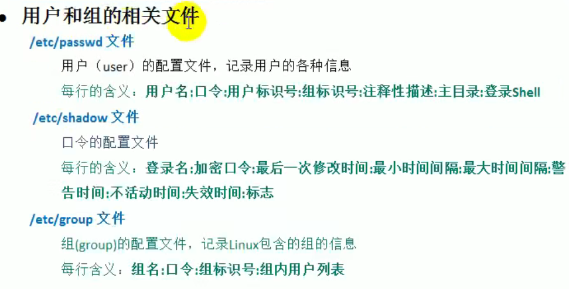

# 启动mysql：

```
systemctl start mysqld 
systemctl status mysqld
mysql -u root -p
密码：   @Lcs26580. 
```


# 启动navicat

```
cd /usr/local
cd /nav  Tab
./start_navicat 

当使用结束时：   cd ~ rm -r .navicat64
```


# 启动Tomcat

```
防火墙添加8080：
firewall-cmd --zone=public --add-port=8080/tcp --permanent


firewall-cmd --zone=public --add-port=3306/tcp --permanent 防火墙开放3306端口
重启防火墙：
firewall-cmd --reload
查看结果：
firewall-cmd --list-ports

```

==或者==

```
cd /opt/tomcat8.5/bin
./sta再tab键

```


# 启动redis

```
/usr/local/bin                    #进入redis的安装目录
redis-server /etc/redis.conf      #用其他位置的配置文件打开redis服务
redis-cli                         #运行redis
ping                              #验证redis是否运行（PONG则成功）
```


# xshell连接不上时：

```
1、登录服务器后
cd /etc/ssh/
vim sshd_config
找到 ClientAliveInterval 0和ClientAliveCountMax 3并将注释符号（”#”）去掉,
将ClientAliveInterval对应的0改成3600,保存。
ClientAliveInterval 指定了服务器端向客户端请求消息 的时间间隔, 默认是0, 不发送.
ClientAliveInterval 3600表示每1个小时发送一次, 然后客户端响应, 这样就保持长连接了.
ClientAliveCountMax, 使用默认值3即可.ClientAliveCountMax表示服务器发出请求后客户端没有响应的次数达到一定值, 就自动断开.

重启ssh
service sshd.service start
```


# 创建用户

```
useradd 用户名； 会在/home目录下创建一个对应的家目录
设置密码：  passwd 用户名

```


## 当前目录下创建文件夹

```
mkdir 文件名
```


## 指定路径创建用户

```
useradd -d /home/zoo hi
passwd hi
```


## 删除用户

```
userdel  用户名    （不删除家目录）
userdel -r 用户名   （删除对应的家目录）
```


# 查看id信息

```
id 用户名
```

```ABAP
uid：用户id号   	gid:所在组的id号   				组：组名
```


# 切换用户

```
su -用户名      
exit				返回到原来的用户
```


## 查看当前用户

```
whoami
```


# ==用户组==和配置文件

==一般为文件的创建者,谁创建了该文件，就自然的成为该文件的所有者。==

```
增加组：    			groupadd  组名
删除组：    			groupdel  组名
增加用户时直接加上组：     useradd -g 用户组  用户名
修改用户的组：           usermod -g 用户组  用户名
ls -ahl:				查看文件的所有者
chown 用户名 文件名		修改文件所有者
chgrp 组名 文件名		修改文件所在的组
```

用户和组的相关文件



## 用户配置文件

/etc/passwd


## 口令配置文件

/etc/shadow


## 组的配置文件

/etc/group


# ==权限==介绍

ls	-l 中显示的内容如下：
-rwx rw- r-- 1 root root 1213 Feb 2 09:39 abc

```ABAP
0-9 位说明
1)第 0 位确定文件类型(d, - , l , c , b)
2)第 1-3 位确定所有者（该文件的所有者）拥有该文件的权限。---User
3)第 4-6 位确定所属组（同用户组的）拥有该文件的权限，---Group
4)第 7-9 位确定其他用户拥有该文件的权限 ---Other

```

```ABAP
10 个字符确定不同用户能对文件干什么

第一个字符代表文件类型： 文件 (-),目录(d),链接(l)

其余字符每 3 个一组(rwx) 读(r) 写(w) 执行(x) 第一组 rwx : 文件拥有者的权限是读、写和执行

第二组 rw- :  与文件拥有者同一组的用户的权限是读、写但不能执行第三组 r-- :	不与文件拥有者同组的其他用户的权限是读不能写和执行可用数字表示为: r=4,w=2,x=1  因此 rwx=4+2+1=7

1	文件：硬连接数或	目录：子目录数
root	用户
root	组
1213	文件大小(字节)，如果是文件夹，显示 4096 字节
Feb 2 09:39	最后修改日期
abc	文件名

```

##  

## rwx 作用到文件

1) [ r ]代表可读(read): 可以读取,查看

2) [ w ]代表可写(write): 可以修改,但是不代表可以删除该文件,删除一个文件的前提条件是对该文件所在的目录有写权限，才能删除该文件.

3) [ x ]代表可执行(execute):可以被执行


## rwx 作用到目录

1) [ r ]代表可读(read): 可以读取，ls 查看目录内容

2) [ w ]代表可写(write): 可以修改,目录内创建+删除+重命名目录

3) [ x ]代表可执行(execute):可以进入该目录


# 指定运行级别

## 运行级别说明：

0  ：关机

1  ：单用户【找回丢失密码】

2：多用户状态没有网络服务

3：多用户状态有网络服务

4：系统未使用保留给用户

5：图形界面

6：系统重启

==常用运行级别是3和5，要修改默认的运行级别可改文件==

==/etc/inittab （系统的默认文件）==


### 切换级别

从图形界面到3界面

```ABAP
systemctl set-default                查看目前默认的启动方式
systemctl set-default graphical.target  图形界面模式
init 3
```

将id:5:initdefault:这一行中的数字, 5 这个数字改成对应的运行级别即可


### ==如何找回root密码==

centos8有点小麻烦

**思路：进入单用户模式**

1. 开机时按e，配置编辑模式
2. 将ro 改为 rw  init=/sysroot/bin/sh
3. 按键 Ctrl  +  x  进入紧急模式
4. 切换根目录为sysroot：   chroot /sysroot/
5. 修改密码：   passwd root
6. touch /.autorelabel   创建文件, selinux从打标签
7. exit                                退出当前跟
8. reboot							重启


# 帮助指令

## man(manual)

man ls:查看所有帮助手册

## help

查看shell命令


# 文件实用命令

## mkdir指令

```
mkdir 指令用于创建目录(make directory)
mkdir -p /a/b：创建多级目录
rmdir 指令删除空目录
如果需要删除非空目录，需要使用	rm -rf /要删除的目录
```


## touch指令

```
touch 指令创建空文件
```


## cp指令

```
cp 指令拷贝文件到指定目录
cp 文件名  目录名

递归复制整个文件夹
cp -r 原文件名 /现文件名      就是将原文件放在现文件的下面目录
```


## rm 指令

```
rm 指令移除【删除】文件或目录
	-r ：递归删除整个文件夹
	-f ： 强制删除不提示
```


##  mv 指令

```
mv 移动文件与目录或重命名
mv	oldNameFile      newNameFile	(功能描述：重命名) 
mv /temp/movefile   /targetFolder   (功能描述：移动文件)
```


##     cat 指令

```
cat 查看文件内容，是以只读的方式打开。
cat -n  显示行号
cat -n 文件  | more  分页显示
```


## more指令

```
more 指令是一个基于 VI 编辑器的文本过滤器，它以全屏幕的方式按页显示文本文件的内容。more 指令中内置了若干快捷键，详见操作说明
```

|  操作  | 功能说明                             |
| :----: | ------------------------------------ |
| 空格键 | 代表向下翻一页                       |
| Enter  | 代表向下翻一行                       |
|   q    | 代表立刻离开more，不在显示该文件内容 |
| ctrl+F | 向下滚动一屏                         |
| ctrl+B | 返回上一屏                           |
|   =    | 输出当前行的行号                     |
|   :f   | 输出文件名和当前行的行号             |


## less指令

```
less 指令用来分屏查看文件内容，它的功能与 more 指令类似，但是比 more 指令更加强大，支持各种显示终端。less 指令在显示文件内容时，并不是一次将整个文件加载之后才显示，而是根据显示需要加载内容，对于显示大型文件具有较高的效率

less 文件名
```

| 操作     | 功能说明                                          |
| -------- | ------------------------------------------------- |
| 空格键   | 向下翻动一页                                      |
| pagedown | 向下翻动一页                                      |
| pageup   | 向上翻动一页                                      |
| /字串    | 向下搜寻【字串】的功能： n：向下查找  N：向上查找 |
| ?字串    | 向上搜寻【字串】的功能： n：向上查找  N：向下查找 |
| q        | 离开less这个程序                                  |


##   > 指令 和 >> 指令

```
> 输出重定向 : 会将原来的文件的内容覆盖
>> 追加： 不会覆盖原来文件的内容，而是追加到文件的尾部。

1) ls -l >文件  （功能描述：列表的内容写入文件 a.txt 中（覆盖写））
2)	ls -al >>文件	（功能描述：列表的内容追加到文件 aa.txt 的末尾）
3)	cat 文件 1 > 文件 2 （功能描述：将文件 1 的内容覆盖到文件 2）
```


## echo 指令

```
echo 输出内容到控制台。
echo $PATH    输出环境变量
```


## head指令

```
head 用于显示文件的开头部分内容，默认情况下 head 指令显示文件的前 10 行内容
head  文件	(功能描述：查看文件头 10 行内容)
head -n 5 文件	(功能描述：查看文件头 5 行内容，5 可以是任意行数)
```


## tail指令

```
tail 用于输出文件中尾部的内容，默认情况下 tail 指令显示文件的后 10 行内容。
tail  文件	(功能描述：查看文件后 10 行内容)
tail -n 5 文件(功能描述：查看文件后5 行内容，5 可以是任意行数)
tail -f 文件  （功能描述：实时追踪该文档的所有更新，工作经常使用）
```


## ln指令

```
软链接也叫符号链接，类似于 windows 里的快捷方式，主要存放了链接其他文件的路径
ln -s [原文件或目录] [软链接名] （功能描述：给原文件创建一个软链接）
当我们使用 pwd 指令查看目录时，仍然看到的是软链接所在目录。
```


##   history 指令

```
查看已经执行过历史命令,也可以执行历史指令
!1 				执行编号为1的指令
history 10      显示最近使用过的 10 个指令

```


## date指令

```
1) 	date			（功能描述：显示当前时间）
2)	date +%Y  		（功能描述：显示当前年份）
3)	date +%m		（功能描述：显示当前月份）
4)	date +%d		（功能描述：显示当前是哪一天）
5)  date "+%Y-%m-%d %H:%M:%S"（功能描述：显示年月日时分秒）

date -s	字符串时间   	设置为字符串时间
cal						显示当前日历
```


## find指令

```
find 指令将从指定目录向下递归地遍历其各个子目录，将满足条件的文件或者目录显示在终端。
find	[搜索范围]	[选项]

```

| 选项            | 功能                             |
| --------------- | -------------------------------- |
| -name<查询方式> | 按照指定的文件名查找模式查找文件 |
| -user<用户名>   | 查找属于指定用户所有文件         |
| -size<文件大小> | 按照指定的文件大小查找文件       |


案例：

```
案例 1: 按文件名：根据名称查找/home 目录下的 hello.txt 文件
find /home -name hello.txt

案例 2：按拥有者：查找/opt 目录下，用户名称为 nobody 的文件
find /opt -user nobody

查找整个 linux 系统下大于 20m 的文件（+n  大于	-n 小于	n 等于）
find / -size +20M
find / -size +20480k

查询	/ 目录下，所有 .txt 的文件
find / -name *.txt
```


## locate指令

```
locaate 指令可以快速定位文件路径。locate 指令利用事先建立的系统中所有文件名称及路径的locate 数据库实现快速定位给定的文件。Locate 指令无需遍历整个文件系统，查询速度较快。为了保证查询结果的准确度，管理员必须定期更新 locate 时刻。
```

==由于 locate 指令基于数据库进行查询，所以第一次运行前，必须使用 updatedb 指令创建 locate 数据库。==

```
案例 1: 请使用 locate 指令快速定位 hello.txt 文件所在目录
updatedb  	创建locate数据库
locate hello.txt
```


## grep指令和管道符号

```
grep 过滤查找 ， 管道符，“|”，表示将前一个命令的处理结果输出传递给后面的命令处理。
grep [选项] 查找内容 源文件
```

| 选项 | 功能           |
| ---- | -------------- |
| -n   | 显示匹配及行号 |
| -i   | 忽略字母大小写 |

```
请在  hello.txt  文件中，查找	"yes"	所在行，并且显示行号
cat hello.txt | grep -n yes    区分大小写
cat hello.txt | grep -ni yes   不区分大小写
```


## 压缩和解压

```
gzip 用于压缩文件， gunzip  用于解压的
gzip 文件	（功能描述：压缩文件，只能将文件压缩为*.gz 文件）
gunzip 文件.gz	（功能描述：解压缩文件命令）

```

==当我们使用 gzip 对文件进行压缩后，不会保留原来的文件==

```
zip 用于压缩文件， unzip 用于解压的，这个在项目打包发布中很有用的
zip	[选项] XXX.zip	将要压缩的内容（功能描述：压缩文件和目录的命令）
unzip [选项] XXX.zip （功能描述：解压缩文件）

zip -r 路径  			递归压缩，即压缩目录
unzip -d <目录> 		指定解压后文件的存放目录
```

案例

```
将 /home 下的 所有文件进行压缩成 mypackage.zip
zip -r myzip.zip /home

将 mypackge.zip 解压到 /opt/tmp 目录下
unzip -d /opt/tmp mypackage.zip
```


```
tar 指令 是打包指令，最后打包后的文件是 .tar.gz 的文件。
tar	[选项]	XXX.tar.gz	打包的内容	(功能描述：打包目录，压缩后的文件格式.tar.gz)
```

| 选项 | 功能               |
| ---- | ------------------ |
| -c   | 产生.tar打包文件   |
| -v   | 显示详细信息       |
| -f   | 指定压缩后的文件名 |
| -z   | 打包同时压缩       |
| -x   | 解包.tar文件       |

```
压缩多个文件，将  /home/a1.txt 和  /home/a2.txt 压缩成	a.tar.gz
tar
tar -zcvf a.tar.gz a1.txt a2.txt

将  a.tar.gz	解压到当前目录
tar -zxvf a.tar.gz

将/home 的文件夹 压缩成 myhome.tar.gz
tar -zcvf myhome.tar.gz /home

将 myhome.tar.gz	解压到 /opt 目录下
tar -zxvf myhome.tar.gz -C /opt
```


