**之所以有Spring CloudAlibaba,是因为Spring Cloud Netflix项目进入维护模式**

​        **也就是,就不是不更新了,不会开发新组件了**

​        **所以,某些组件都有代替版了,比如Ribbon由Loadbalancer代替,等等**

==支持的功能==


几乎可以将之前的Spring Cloud代替

==具体组件==:
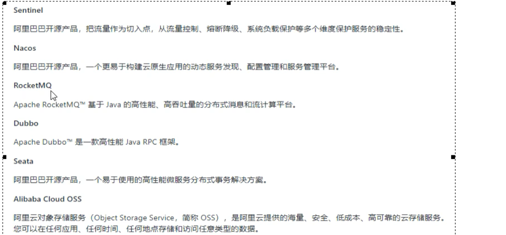

## Nacos:

**服务注册和配置中心的组合**

 Nacos=erueka+config+bus    ---->> (服务中心+配置中心)

### 安装Nacos:

需要java8 和 Maven

**1,到github上下载安装包**

 解压安装包

**2,启动Nacos**

 在bin下,进入cmd

startup.cmd -m standalone

**3,访问Nacos**

 Nacos默认监听8848

 localhost:8848/nacos

 账号密码:默认都是nacos

### 使用Nacos:

新建pay模块

​        **现在不需要额外的服务注册模块了,Nacos单独启动了**

名字: cloudalibaba-pay-9001

#### 1,pom

父项目管理alibaba的依赖:

```java
<dependency>
<groupId>com.alibaba.cloud</groupId>
 <artifactId>spring-cloud-alibaba-dependencies</artifactId>
  <version>2.2.5.RELEASE</version>
<type>pom</type>
 <scope>import</scope>
</dependency>
```


==9001的pom==:

```java
<dependencies>
    <!--springcloud alibaba nacos -->
    <dependency>
        <groupId>com.alibaba.cloud</groupId>
        <artifactId>spring-cloud-starter-alibaba-nacos-discovery</artifactId>
    </dependency>
    <dependency>
        <groupId>org.springframework.boot</groupId>
        <artifactId>spring-boot-starter-web</artifactId>
    </dependency>
    <dependency>
        <groupId>org.springframework.boot</groupId>
        <artifactId>spring-boot-starter-actuator</artifactId>
    </dependency>


    <!--一般基础通用配置-->
    <dependency>
        <groupId>org.springframework.boot</groupId>
        <artifactId>spring-boot-devtools</artifactId>
        <scope>runtime</scope>
        <optional>true</optional>
    </dependency>
    <dependency>
        <groupId>org.projectlombok</groupId>
        <artifactId>lombok</artifactId>
        <optional>true</optional>
    </dependency>
    <dependency>
        <groupId>org.springframework.boot</groupId>
        <artifactId>spring-boot-starter-test</artifactId>
        <scope>test</scope>
    </dependency>
</dependencies>
```


#### 2,配置文件

```java
server:
  port: 9001

spring:
  application:
    name: nacos-payment-provider
  cloud:
    nacos:
      server-addr: localhost:8848 #配置Nacos地址

management:
  endpoints:
    web:
      exposure:
        include: '*'
```


#### 	3,启动类

```java
@SpringBootApplication
@EnableDiscoveryClient
public class PaymentMain9001 {
    public static void main(String[] args) {
            SpringApplication.run(PaymentMain9001.class,args );
        }
}
```


#### 4,controller:

```java
@RestController
public class paymentController {

    @Value("${server.port}")
    private  String serverPort;

    @GetMapping("/payment/nacos/{id}")
    public String getPayment(@PathVariable("id") Integer id){
        return "nacos register serverPoet:"+serverPort+"\t id"+id;
    }
}
```

#### 5,测试

启动9001

然后查看Nacos的服务管理下的服务列表界面,可以看到9001已经注册成功

###  

### 创建其他Pay模块

 额外在创建9002,9003

 直接复制上面的即可，并修改其对应的端口号

### 虚拟映射

右键9001

vmoption中输入

```ABAP
-DServer.port=9011
```


然后未启动下方就有一个9011，点击启动即可

```java
http://localhost:9011/payment/nacos/31下面的端口号显示就为9001
```


### 创建order模块

名字:  cloudalibaba-order-83

#### 1,pom

**为什么Nacos支持负载均衡?**

 Nacos直接集成了Ribon,所以有负载均衡

#### 2,配置文件

```java
server:
  port: 83

spring:
  application:
    name: nacos-order-consumer
  cloud:
    nacos:
      discovery:
        server-addr: localhost:8848

#消费者要去访问的微服务名称（注册成功进nocas微服务的提供者）
service-url:
  nacos-user-service: http://nacos-payment-provider
```

**这个server-url的作用是,我们在controller,需要使用RestTempalte远程调用9001,**

​        **这里是指定9001的地址**

#### 3,主启动类

```java
@SpringBootApplication
@EnableDiscoveryClient
public class OrderMain83 {
    public static void main(String[] args) {
            SpringApplication.run(OrderMain83.class,args );
        }
}
```


#### 4,编写配置类

 ==因为Naocs要使用Ribbon进行负载均衡,那么就需要使用RestTemplate==

```java
@Configuration
public class ApplicationContextConfig {

    @Bean
    @LoadBalanced
    public RestTemplate getRestTemplate(){
        return new RestTemplate();
    }
}
```


#### 5,controller:

```java
@RestController
@Slf4j
public class OrderNacosController {
    @Resource
    private RestTemplate restTemplate;

    @Value("${service-url.nacos-user-service}")
    private String serverURL;

    @GetMapping("/consumer/payment/nacos/{id}")
    public String PaymentInfo(@PathVariable("id") Long id){
        return restTemplate.getForObject(serverURL+"/payment/nacos/"+id, String.class);
        //这里还是使用RestTemplate进行远程调用
    }
}
```


#### 6,测试

启动83,访问9001,9002,可以看到,实现了负载均衡

[测试负载均衡](http://localhost:83/consumer/payment/nacos/31)

### Nacos与其他服务注册的对比

Nacos它既可以支持CP,也可以支持AP,可以切换

==Consistency（一致性）、 Availability（可用性）、Partition tolerance（分区容错性）==

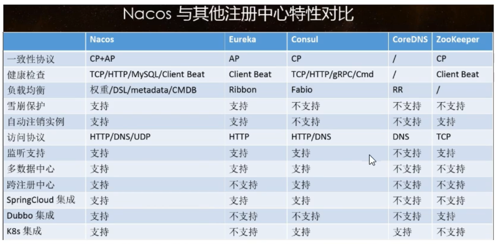


==下面这个curl命令,就是切换模式==

```ABAP
curl-X PUT '$NACOS_SERVER:8848/nacos/v1/ns/operator/switches?entry=serverMode&value=CP'
```


### 使用Nacos作为配置中心:

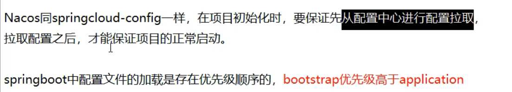

**==需要创建配置中心的客户端模块==**

cloudalibaba3-Nacos-config-client-3377

#### 1,pom

```java
<dependencies>
        <!--nacos-config-->
        <dependency>
            <groupId>com.alibaba.cloud</groupId>
            <artifactId>spring-cloud-starter-alibaba-nacos-config</artifactId>
        </dependency>
        <!--nacos-discovery-->
        <dependency>
            <groupId>com.alibaba.cloud</groupId>
            <artifactId>spring-cloud-starter-alibaba-nacos-discovery</artifactId>
        </dependency>
      <dependency>
            <groupId>org.springframework.cloud</groupId>
            <artifactId>spring-cloud-starter-bootstrap</artifactId>
        </dependency>
        <!--web + actuator-->
        <dependency>
            <groupId>org.springframework.boot</groupId>
            <artifactId>spring-boot-starter-web</artifactId>
        </dependency>
        <dependency>
            <groupId>org.springframework.boot</groupId>
            <artifactId>spring-boot-starter-actuator</artifactId>
        </dependency>
        <!--一般基础配置-->
        <dependency>
            <groupId>org.springframework.boot</groupId>
            <artifactId>spring-boot-devtools</artifactId>
            <scope>runtime</scope>
            <optional>true</optional>
        </dependency>
        <dependency>
            <groupId>org.projectlombok</groupId>
            <artifactId>lombok</artifactId>
            <optional>true</optional>
        </dependency>
        <dependency>
            <groupId>org.springframework.boot</groupId>
            <artifactId>spring-boot-starter-test</artifactId>
            <scope>test</scope>
        </dependency>
    </dependencies>
```


#### 2,配置文件

这里需要配置两个配置文件,application.yml和bootstarp.yml

 主要是为了可以与spring clodu config无缝迁移

bootstrap.yml中：

```java
server:
  port: 3377
spring:
  application:
    name: nacos-config-client
  cloud:
    nacos:
      discovery:
        server-addr: localhost:8848 #Nacos服务注册中心
      config:
        server-addr: localhost:8848 #指定作为配置中心在Nacos的地址
        file-extension: yaml        #指定ymal格式的配置
```


application.yml中：

```java
spring:
  profiles:      #要去配置中心拉取xxxdevxxx.yml的配置文件
    active: dev  #表示开发环境
```


#### 3,主启动类

```java
@SpringBootApplication
@EnableDiscoveryClient
public class NacosConfigClientMain3377 {
    public static void main(String[] args) {
            SpringApplication.run(NacosConfigClientMain3377.class,args );
        }
}
```


#### 4,controller

```java
@RestController
@RefreshScope//支持Nacos动态刷新
public class ConfigClientController {

    @Value("${config.info}")
    private String configInfo;

    @GetMapping("/config/info")
    public String getConfigInfo(){
        return  configInfo;
    }
}
```

```java
可以看到,这里也添加了@RefreshScope  		之前在Config配置中心,也是添加这个注解实现动态刷新的
```


#### 5,在Nacos添加配置信息:

==**Nacos的配置规则:**==


**配置规则,就是我们在客户端如何指定读取配置文件,配置文件的命名的规则**

默认的命名方式:


```java
prefix:
        默认就是当前服务的服务名称
        也可以通过spring.cloud.necos.config.prefix配置
        spring.profile.active:
        就是我们在application.yml中指定的,当前是开发环境还是测试等环境
        这个可以不配置,如果不配置,那么前面的-也会没有
        file-extension
        就是当前文件的格式(后缀),目前只支持yml和properties
```

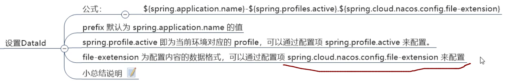

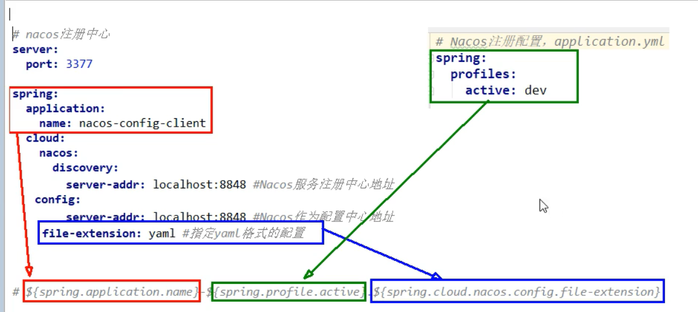

==在web UI上创建配置文件:==

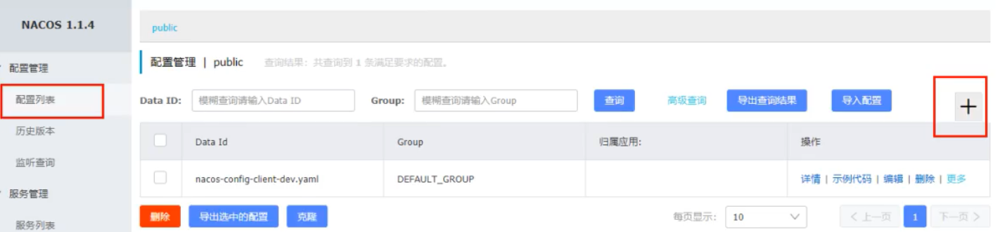

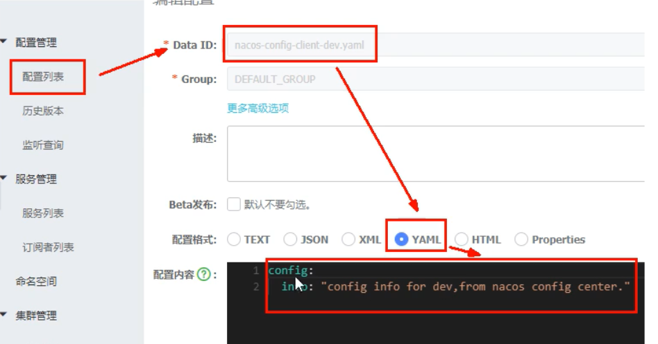

注意,DataId就是配置文件名字:

 名字一定要按照上面的==规则==命名,否则客户端会读取不到配置文件

```ABAP
nacos-config-client-dev.yamlconfig:  info: "config info for dev,from nacos config center version=dev" 
```


#### 6,测试

重启3377客户端

[测试](http://localhost:3377/config/info)

**拿到了配置文件中的值**

#### 7,注意默认就开启了自动刷新

此时我们修改了配置文件

客户端是可以立即更新的

 因为Nacos支持Bus总线,会自动发送命令更新所有客户端

### Nacos配置中心之分类配置:

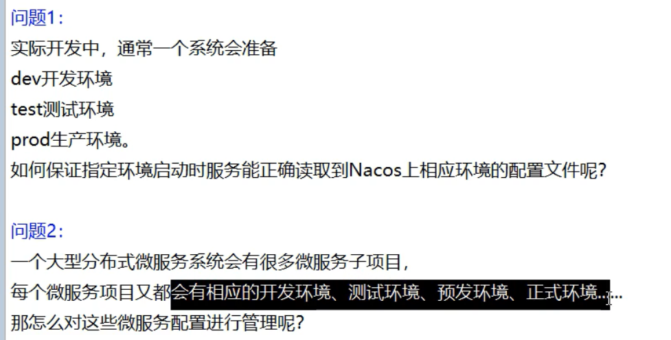

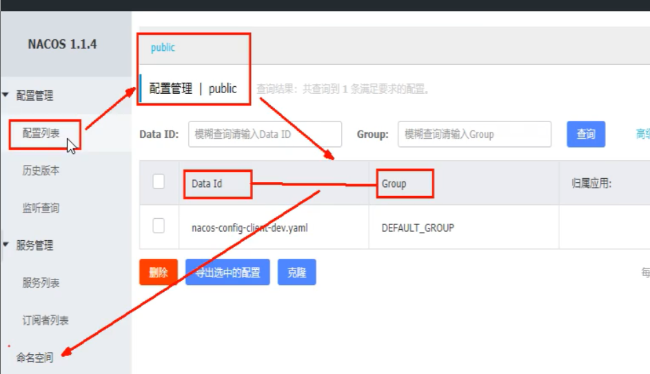


NameSpace默认有一个:public名称空间

这三个类似java的: 包名 + 类名 + 方法名

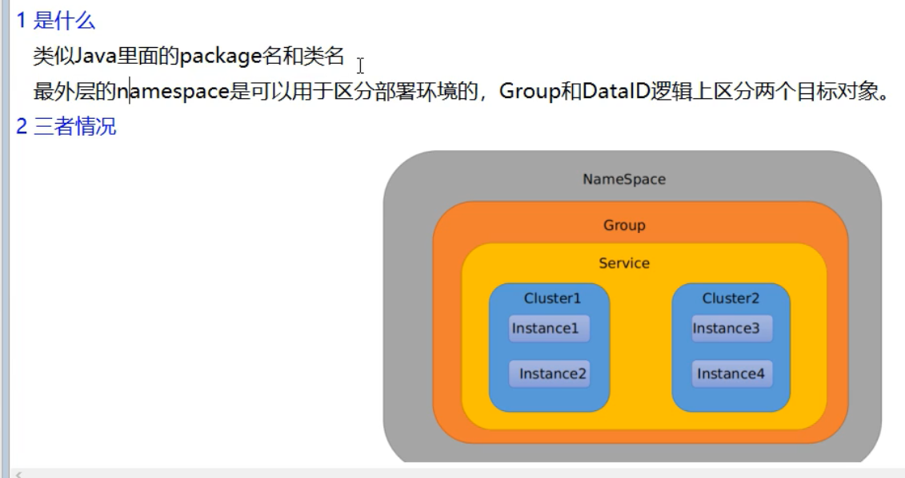

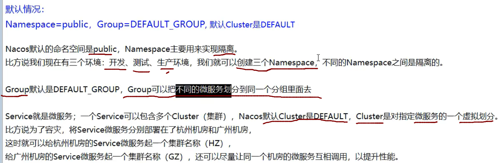

#### 1,配置不同DataId:


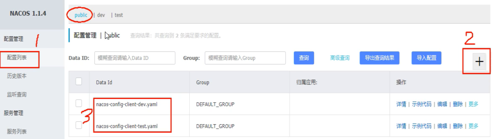

 ==通过配置文件,实现多环境的读取:==

在applica.yml中

```
spring:
  profiles:
    active: test     #要去配置中心拉取xxxdevxxx.yml的配置文件:
    #active: dev  #表示开发环境
    
    #配置什么就加载什么
```

```java
此时,改为dev,就会读取dev的配置文件,改为test,就会读取test的配置文件
```

#### 2,配置不同的GroupID:

直接在新建配置文件时指定组

```java
config:  info: nacos-config-client-info.yaml,Dev_GROUP
```

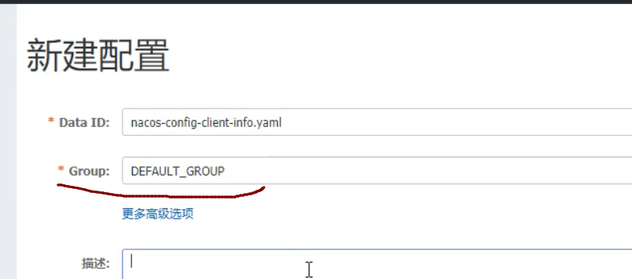

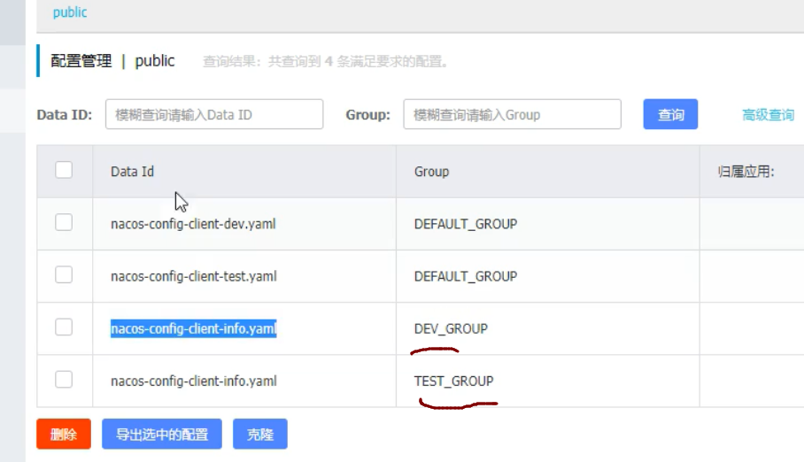

==在客户端配置,使用指定组的配置文件:==


**这两个配置文件都要修改**

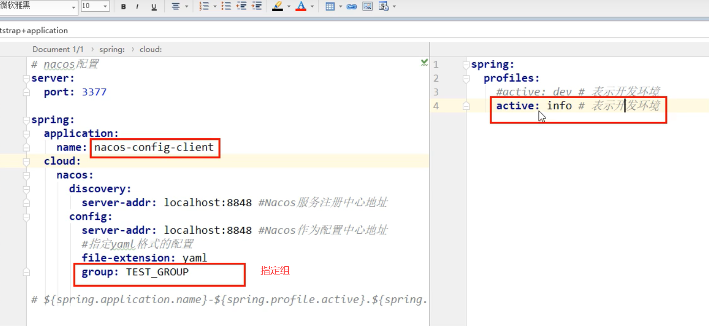


重启服务,即可

#### 配置不同的namespace:

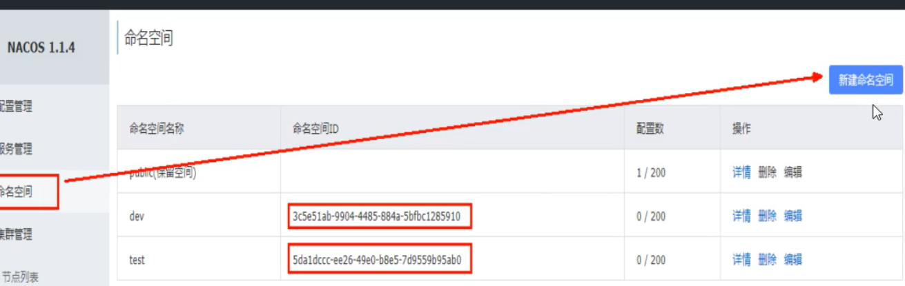

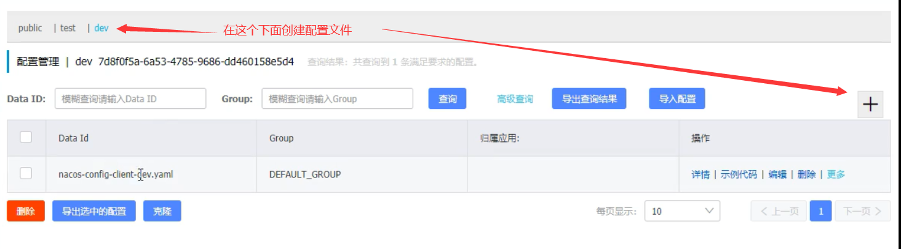

```ABAP
nacos-config-client-dev.yaml
```

==客户端配置使用不同名称空间:==

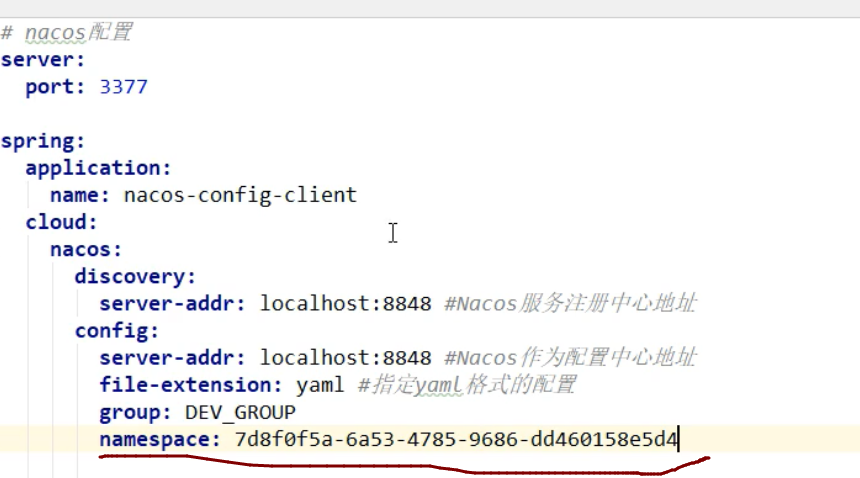

**要通过命名空间id指定**

OK，[测试](http://localhost:3377/config/info)

### Nacos集群和持久化配置:

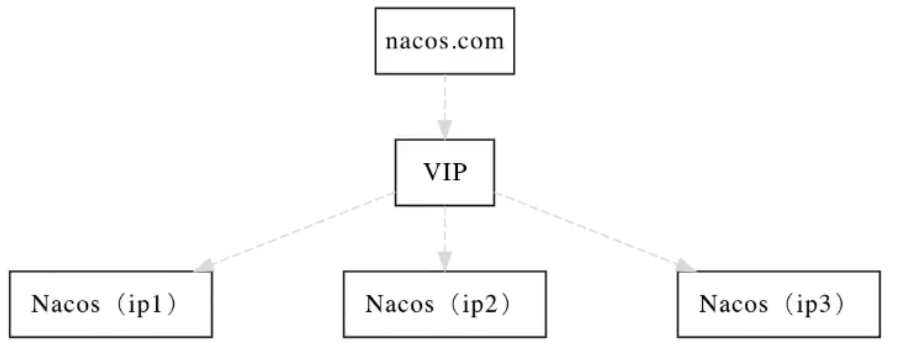

Nacos默认有自带嵌入式数据库,derby,但是如果做集群模式的话,就不能使用自己的数据库

 不然每个节点一个数据库,那么数据就不统一了,需要使用外部的mysql

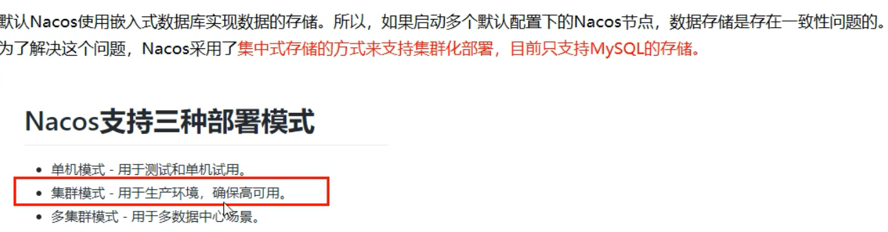

#### 1,单机版,切换mysql数据库:

​                    **将nacos切换到使用我们自己的mysql数据库:**

**1,nacos默认自带了一个sql文件,在nacos安装目录下**

 将它放到我们的mysql执行

**2,修改Nacos安装目录下的安排application.properties,添加:**

[官网上这么写的](https://nacos.io/zh-cn/docs/deployment.html)

```java
spring.datasource.platform=mysql
[mysqld]character_set-server=utf8
db.num=1
db.url.0=jdbc:mysql://127.0.0.1:3306/nacos_config?characterEncoding=utf8&connectTimeout=1000&socketTimeout=3000&autoReconnect=true&serverTimezone=UTC
db.user=root
db.password=1234
```

==mysql8.0然后在nocas安装目录下添加nacos\plugins\mysql目录   并把相关的驱动放入进去==

**3,此时可以重启nacos,那么就会改为使用我们自己的mysql**

#### 

[==centos8安装教程==](https://blog.csdn.net/renfeigui0/article/details/102543039)

```ABAP
/boot  要设置300-500M
有线设置时，要设置自己电脑的ip
```

#### Linux上配置Nacos集群+Mysql数据库

==官方架构图:==


**需要一个Nginx作为VIP**

1,下载安装Nacos的Linux版安装包

2,进入安装目录,现在执行自带的sql文件

 进入mysql,执行sql文件

3.修改配置文件,切换为我们的mysql

 就是上面windos版要修改的几个属性

4,修改cluster.conf,指定哪几个节点是Nacos集群

 这里使用3333,4444,5555作为三个Nacos节点监听的端口


5,我们这里就不配置在不同节点上了,就放在一个节点上

 既然要在一个节点上启动不同Nacos实例,就要修改startup.sh,使其根据不同端口启动不同Nacos实例

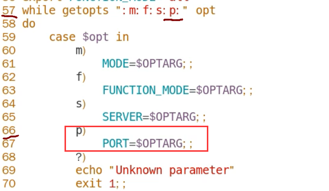

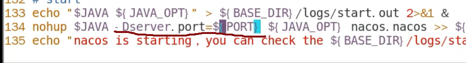

可以看到,这个脚本就是通过jvm启动nacos

 所以我们最后修改的就是,nohup java -Dserver.port=3344

6,配置Nginx:

​            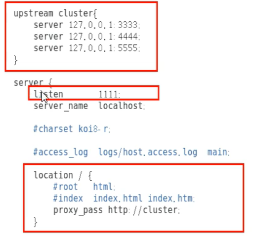

7,启动Nacos:
./startup.sh -p 3333

 ./startup.sh -p 4444

 ./startup.sh -p 5555

7,启动nginx,nacos

```
查看nacos的进程数
ps -ef | grep nacos |grep -v grep | wc -l
```

8,测试:

 访问192.168.159.121:1111

 如果可以进入nacos的web界面,就证明安装成功了

9,将微服务注册到Nacos集群:
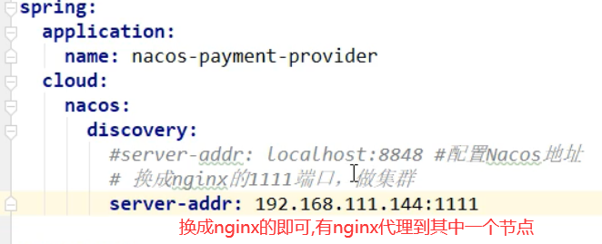


10,进入Nacos的web界面

 可以看到,已经注册成功

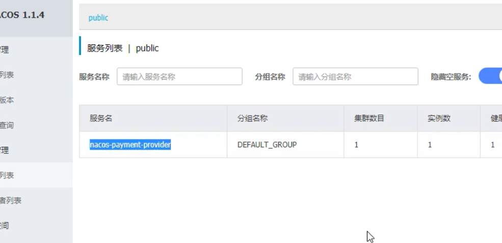

