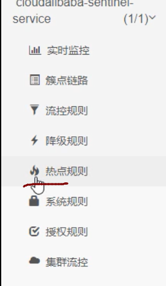

## Sentinel:

实现熔断与限流,就是Hystrix


​    

### ==使用sentinel:==

1,下载sentinel的jar包

2,运行sentinel

==在当前目录下使用cmd用8070端口==

https://blog.csdn.net/w995223851/article/details/115399917

```ABAP
java -Dserver.port=8070 -Dcsp.sentinel.dashboard.server=localhost:8070 -Dproject.name=sentinel-dashboard -jar sentinel-dashboard-1.7.1.jar
```

 注意,默认sentinel占用8080端口

3,访问sentinel

 localhost:8070

==账号密码都为：sentinel==

### 微服务整合sentinel:

##### 1,启动Nacos的jar包

##### 2,新建一个项目,8401,主要用于配置sentinel

1. pom

   ```
    <dependencies>
           <dependency><!-- 引入自己定义的api通用包，可以使用Payment支付Entity -->
               <groupId>springcloud</groupId>
               <artifactId>cloud3-api-commons</artifactId>
               <version>${project.version}</version>
           </dependency>
           <!--SpringCloud ailibaba nacos -->
           <dependency>
               <groupId>com.alibaba.cloud</groupId>
               <artifactId>spring-cloud-starter-alibaba-nacos-discovery</artifactId>
           </dependency>
           <!--SpringCloud ailibaba sentinel-datasource-nacos 后续sentinel做持久化用到-->
           <dependency>
               <groupId>com.alibaba.csp</groupId>
               <artifactId>sentinel-datasource-nacos</artifactId>
           </dependency>
           <!--SpringCloud ailibaba sentinel -->
           <dependency>
               <groupId>com.alibaba.cloud</groupId>
               <artifactId>spring-cloud-starter-alibaba-sentinel</artifactId>
           </dependency>
           <!--openfeign-->
           <dependency>
               <groupId>org.springframework.cloud</groupId>
               <artifactId>spring-cloud-starter-openfeign</artifactId>
           </dependency>
           <!-- SpringBoot整合Web组件+actuator -->
           <dependency>
               <groupId>org.springframework.boot</groupId>
               <artifactId>spring-boot-starter-web</artifactId>
           </dependency>
           <dependency>
               <groupId>org.springframework.boot</groupId>
               <artifactId>spring-boot-starter-actuator</artifactId>
           <dependency>
               <groupId>cn.hutool</groupId>
               <artifactId>hutool-all</artifactId>
               <version>5.1.0</version>
           </dependency>
           <dependency>
               <groupId>org.projectlombok</groupId>
               <artifactId>lombok</artifactId>
               <optional>true</optional>
           </dependency>
           <dependency>
               <groupId>org.springframework.boot</groupId>
               <artifactId>spring-boot-starter-test</artifactId>
               <scope>test</scope>
           </dependency>
   
       </dependencies>
   ```

   

2. 配置文件

   ```java
   server:
     port: 8401
   
   spring:
     application:
       name: cloudalibaba-sentinel-service
     cloud:
       nacos:
         discovery:
           server-addr: localhost:8848 #Nacos服务注册中心地址
       sentinel:
         transport:
           dashboard: localhost:8070 #配置Sentinel dashboard地址
           port: 8719
         
   
   management:
     endpoints:
       web:
         exposure:
           include: '*'
   ```

   

3. 主启动类

   ```java
   @EnableDiscoveryClient
   @SpringBootApplication
   public class MainApp8401 {
       public static void main(String[] args) {
               SpringApplication.run(MainApp8401.class,args );
           }
   }
   ```

   

4. controller

   ```java
   @RestController
   public class FlowLimitController {
   
       @GetMapping("/testA")
       public  String testA(){
           return  "-----testA!";
       }
       @GetMapping("/testB")
       public  String testB(){
           return  "-----testB!";
       }
   }
   
   ```

   

5. 到这里就可以启动8401

 此时我们到sentinel中查看,发现并8401的任何信息

 是因为,sentinel是懒加载,需要我们执行一次访问,才会有信息

```ABAP
 访问localhost:8401/testA
```


6. 可以看到.已经开始监听了


### sentinel的流控规则

流量限制控制规则


==流控模式==:

#### 直接快速失败


   ==直接失败的效果:==


#### 线程数:

```abap
在A中添加线程休息@GetMapping("/testA")   
public  String testA(){       
	try {  TimeUnit.SECONDS.sleep(1000);}
    catch (InterruptedException e) {  
    e.printStackTrace(); 
    }        
    return  "-----testA!";  
    }
```

​        

​    

```
比如a请求过来,处理很慢,在一直处理,此时b请求又过来了        此时因为a占用一个线程,此时要处理b请求就只有额外开启一个线程        那么就会报错
```


#### 关联:


==应用场景:  比如**支付接口**达到阈值,就要限流下**订单的接口**,防止一直有订单==


**当testA达到阈值,qps大于1,就让testB之后的请求直接失败**

可以使用postman压测（ctrl+R手动刷新也可实现）


#### 链路:

多个请求调用同一个微服务


#### 预热Warm up:

​	 

  

 

 ==应用场景==

 


#### 排队等待:


### 降级规则:

**就是熔断降级**


#### 1,RT配置:

新增一个请求方法用于测试


==配置RT:==

 这里配置的PT,默认是秒级的平均响应时间


默认计算平均时间是: 1秒类进入5个请求,并且响应的平均值小于阈值(这里的200ms),就报错]

 1秒5请求是Sentinel默认设置的

==测试==

==按住ctrl+R一直刷新就可以实现==


**默认熔断后.就直接抛出异常**

#### 2,异常比例:


修改请求方法


配置:


==如果没触发熔断,这正常抛出异常==:


==触发熔断==:


#### 3, 异常数:


一分钟之内,有5个请求发送异常,进入熔断

### 热点规则:



​    

比如:

 localhost:8070/aa?name=aa

 localhost:8070/aa?name=b'b

 加入两个请求中,带有参数aa的请求访问频次非常高,我们就现在name==aa的请求,但是bb的不限制

==如何自定义降级方法,而不是默认的抛出异常?==


**使用@SentinelResource直接实现降级方法,它等同Hystrix的@HystrixCommand**

```java
  @GetMapping ("/testHotkey")
    @SentinelResource(value = "testHotkey",blockHandler = "deal_testHotkey")
    public String testHotkey(@RequestParam(value ="p1",required = false) String p1,
                             @RequestParam(value ="p2",required = false) String p2){

        return "-testHotkey";
    }
    public String deal_testHotkey(String p1, String p2, BlockException exception){
        return "----deal_testHotkey,┭┮﹏┭┮";//sentinel 系统默认的提示: Blocked by sentinel (flow limiting)

    }
```


#### ==1定义热点规则:==


**此时我们访问/testHotkey并且带上才是p1**

 如果qps大于1,就会触发我们定义的降级方法


**但是我们的参数是P2,就没有问题**


只要带了p1,才可能会触发热点限流


#### 2,设置热点规则中的其他选项:


**需求:**


==测试==


**注意:**

参数类型只支持,8种基本类型+String类

==注意:==

如果我们程序出现异常,是不会走blockHander的降级方法的,因为这个方法只配置了热点规则,没有配置限流规则

我们这里配置的降级方法是sentinel针对热点规则配置的

只有触发热点规则才会降级


### 3,系统规则:

系统自适应限流:
从整体维度对应用入口进行限流

对整体限流,比如设置qps到达100,这里限流会限制整个系统不可以

**


==测试==:


### @SentinelResource注解:

**用于配置降级等功能**

1,环境搭建

1. 为8401添加依赖

   添加我们自己的commone包的依赖

   

2. 额外创建一个controller类

   ```java
   @RestController
   public class RateLimitController {
   
   
       @GetMapping("/byResource")
       @SentinelResource(value = "byResource",blockHandler = "handleException")
       public CommonResult byResource(){
       return new CommonResult( 200,  "按资源名称限流测试oK", new Payment( 2020L, "serialea1"));
       }
   
       public CommonResult handleException (BlockException exception){
       return new CommonResult(  444,  exception.getClass() .getCanonicalName()+"\t服务不可用");
       }
   }
   ```

   [测试](http://localhost:8401/byResource)如出现如下

   ```
   This XML file does not appear to have any style information associated with it. The document tree is shown below.
   ```

   修改pom中的

   ```java
      <!--SpringCloud ailibaba sentinel -->
           <dependency>
               <groupId>com.alibaba.cloud</groupId>
               <artifactId>spring-cloud-starter-alibaba-sentinel</artifactId>
               <exclusions>
                   <exclusion>
                       <groupId>com.fasterxml.jackson.dataformat</groupId>
                       <artifactId>jackson-dataformat-xml</artifactId>
                   </exclusion>
               </exclusions>
           </dependency>
   ```

   

​     


3. 配置限流

   **注意,我们这里配置规则,资源名指定的是@SentinelResource注解value的值,**

   **这样也是可以的,也就是不一定要指定访问路径**

   

4. 测试.

   可以看到已经进入降级方法了

   

5. ==此时我们关闭8401服务==

   可以看到,这些定义的规则是临时的,关闭服务,规则就没有了

   

**可以看到,上面配置的降级方法,又出现Hystrix遇到的问题了**

 降级方法与业务方法耦合

 每个业务方法都需要对应一个降级方法

#### 自定义限流处理逻辑:

1. ==单独创建一个类,用于处理限流==

   ```java
   public class CustomerBlockHandler {
   
       public static CommonResult handlerException(BlockException exception) {
           return new CommonResult(4444, "按客戶自定义,global handlerException----1");
       }
   
       public static CommonResult handlerException2(BlockException exception) {
           return new CommonResult(4444, "按客戶自定义,global handlerException----2");
       }
   }
   ```

   

2. ==在controller中,指定使用自定义类中的方法作为降级方法==

   ```java
   @GetMapping ("/rateLimit/customerBlockHandler")
       @SentinelResource(value ="customerBlockHandler",
               blockHandlerClass = CustomerBlockHandler.class,blockHandler = "handlerException2")
       public CommonResult customerBlockHandler(){
           return new CommonResult(  200,  "按用户自定义", new Payment(  2020L,  "serial1003"));
       }
   ```

   ```ABAP
   降级调用CustomerBlockHandler这个类，降级方法handlerException2
   ```

   

3. ==Sentinel中定义流控规则==:

   这里资源名,是以url指定,也可以使用@SentinelResource注解value的值指定

   ==/rateLimit/byUrl测试的是url==

   ==将下面的资源名应为customerBlockHandler==

   


4. ==测试==:

   

5. ==整体==:

   

6.

#### @SentinelResource注解的其他属性:


### 服务熔断:

1. **启动nacos和sentinel的jar包**

2. **新建两个pay模块 9003和9004**

3. pom

   ```java
   <dependencies>
           <!--SpringCloud ailibaba nacos -->
           <dependency>
               <groupId>com.alibaba.cloud</groupId>
               <artifactId>spring-cloud-starter-alibaba-nacos-discovery</artifactId>
           </dependency>
           <dependency><!-- 引入自己定义的api通用包，可以使用Payment支付Entity -->
               <groupId>springcloud</groupId>
               <artifactId>cloud3-api-commons</artifactId>
               <version>${project.version}</version>
           </dependency>
           <!-- SpringBoot整合Web组件 -->
           <dependency>
               <groupId>org.springframework.boot</groupId>
               <artifactId>spring-boot-starter-web</artifactId>
           </dependency>
           <dependency>
               <groupId>org.springframework.boot</groupId>
               <artifactId>spring-boot-starter-actuator</artifactId>
           </dependency>
        
           <dependency>
               <groupId>org.projectlombok</groupId>
               <artifactId>lombok</artifactId>
               <optional>true</optional>
           </dependency>
           <dependency>
               <groupId>org.springframework.boot</groupId>
               <artifactId>spring-boot-starter-test</artifactId>
               <scope>test</scope>
           </dependency>
       </dependencies>
   
   ```

   

4. 配置文件

   ```java
   server:
     port: 9003
   
   spring:
     application:
       name: nacos-payment-provider
     cloud:
       nacos:
         discovery:
           server-addr: localhost:8848 #配置Nacos地址
   
   management:
     endpoints:
       web:
         exposure:
           include: '*'
   
   ```

   

5. 主启动类

   ```java
   @SpringBootApplication
   @EnableDiscoveryClient
   public class PaymentMain9003 {
       public static void main(String[] args) {
         SpringApplication.run(PaymentMain9003.class,args );
           }
   }
   ```

6. controller

   ```java
   @RestController
   public class paymentController {
       public static HashMap<Long, Payment> hashMap = new HashMap<>();
   
       static {
           hashMap.put(1L, new Payment(1L, "28a8c1e3bc2742d8848569891fb42181"));
           hashMap.put(2L, new Payment(2L, "bba8c1e3bc2742d8848569891ac32182"));
           hashMap.put(3L, new Payment(3L, "6ua8c1e3bc2742d8848569891xt92183"));
       }
   
       @Value("${server.port}")
       private String serverPort;
   
       @GetMapping(value = "/paymentSQL/{id}")
       public CommonResult<Payment> paymentSQL(@PathVariable("id") Long id) {
           Payment payment = hashMap.get(id);
           CommonResult<Payment> result = new CommonResult(200, "from mysql,serverPort:  " + serverPort, payment);
           return result;
       }
   }
   ```

   **然后启动9003.9004**

7. ==**新建一个order-84消费者模块:**==

8. pom

   ```java
   <dependencies>
           <!--SpringCloud openfeign -->
           <dependency>
               <groupId>org.springframework.cloud</groupId>
               <artifactId>spring-cloud-starter-openfeign</artifactId>
           </dependency>
           <!--SpringCloud ailibaba nacos -->
           <dependency>
               <groupId>com.alibaba.cloud</groupId>
               <artifactId>spring-cloud-starter-alibaba-nacos-discovery</artifactId>
           </dependency>
           <!--SpringCloud ailibaba sentinel -->
           <dependency>
               <groupId>com.alibaba.cloud</groupId>
               <artifactId>spring-cloud-starter-alibaba-sentinel</artifactId>
               <exclusions>
                   <exclusion>
                       <groupId>com.fasterxml.jackson.dataformat</groupId>
                       <artifactId>jackson-dataformat-xml</artifactId>
                   </exclusion>
               </exclusions>
           </dependency>
           <!-- 引入自己定义的api通用包，可以使用Payment支付Entity -->
           <dependency>
               <groupId>springcloud</groupId>
               <artifactId>cloud3-api-commons</artifactId>
               <version>${project.version}</version>
           </dependency>
           <!-- SpringBoot整合Web组件 -->
           <dependency>
               <groupId>org.springframework.boot</groupId>
               <artifactId>spring-boot-starter-web</artifactId>
           </dependency>
           <dependency>
               <groupId>org.springframework.boot</groupId>
               <artifactId>spring-boot-starter-actuator</artifactId>
           </dependency>
           <dependency>
               <groupId>org.projectlombok</groupId>
               <artifactId>lombok</artifactId>
               <optional>true</optional>
           </dependency>
           <dependency>
               <groupId>org.springframework.boot</groupId>
               <artifactId>spring-boot-starter-test</artifactId>
               <scope>test</scope>
           </dependency>
       </dependencies>
   
   ```

   

9. 配置文件

   ```java
   server:
     port: 84
   
   spring:
     application:
       name: nacos-order-consumer
     cloud:
       nacos:
         discovery:
           server-addr: localhost:8848
       sentinel:
         transport:
           #配置Sentinel dashboard地址
           dashboard: localhost:8070  #自己设置的sentinel启动端口号
           #默认8719端口，假如被占用会自动从8719开始依次+1扫描,直至找到未被占用的端口
           port: 8719
   
   #消费者将要去访问的微服务名称(注册成功进nacos的微服务提供者)
   service-url:
     nacos-user-service: http://nacos-payment-provider
   
   # 激活Sentinel对Feign的支持
   feign:
     sentinel:
       enabled: true
   ```

   

10. 主启动类

    ```java
    @SpringBootApplication
    @EnableDiscoveryClient
    public class OrderNacosMain84 {
        public static void main(String[] args) {
                SpringApplication.run(OrderNacosMain84.class,args );
            }
    }
    ```

    

11. 配置类

    ```java
    @Configuration
    public class ApplicationContextConfig {
    
        @Bean
        @LoadBalanced
        public RestTemplate restTemplate(){
            return  new RestTemplate();
        }
    }
    ```

    

12. controller

    ```java
    public class CircleBreakerController {
        public static final String SERVICE_URL = "http://nacos-payment-provider";
    
        @Resource
        private RestTemplate restTemplate;
    
        @RequestMapping("/consumer/fallback/{id}")
       @SentinelResource(value = "fallback") //没有配置
        public CommonResult<Payment> fallback(@PathVariable Long id) {
            CommonResult<Payment> result = restTemplate.getForObject(SERVICE_URL + "/paymentSQL/" + id, CommonResult.class, id);
    
            if (id == 4) {
                throw new IllegalArgumentException("IllegalArgumentException,非法参数异常....");
            } else if (result.getData() == null) {
                throw new NullPointerException("NullPointerException,该ID没有对应记录,空指针异常");
            }
    
            return result;
        }
    ```

    [测试](http://localhost:84/consumer/fallback/3)实现轮询

    6. **==为业务方法添加fallback来指定降级方法==**:

       

       ​	==重启order==

       测试:

       

        

        ==所以,fallback是用于管理异常的,当业务方法发生异常,可以降级到指定方法==

       ​			注意,我们这里==并没有使用sentinel配置任何规则==,但是却降级成功,就是因为

       ​			fallback是用于管理异常的,当业务方法发生异常,可以降级到指定方法==

       

    7. **==为业务方法添加blockHandler,看看是什么效果==**

       

       **重启84,访问业务方法:**

       

        可以看到.,直接报错了,并没有降级

       ​				也就是说,blockHandler==只对sentienl定义的规则降级==

        

    8. **==如果fallback和blockHandler都配置呢?==**]

       

       **设置qps规则,阈值1**

       

       ==测试:==

       

        

        可以看到,当两个都同时生效时,==blockhandler优先生效==

    9. **==@SentinelResource还有一个属性,exceptionsToIgnore==**

        

        **exceptionsToIgnore指定一个异常类,**

       ​					**表示如果当前方法抛出的是指定的异常,不降级,直接对用户抛出异常**

        

### sentinel整合ribbon+openFeign+fallback

1. 修改84模块,使其支持feign

   1. pom

      添加openfeign的依赖 

      前面已经添加过了

      

   2. 配置文件

      添加激活sentinel对Fegin的支持，前面已添加过

      

   3. 主启动类,也要修改

      

   4. 创建远程调用pay模块的接口

      

   5. 创建这个接口的实现类,用于降级

      

   6. 再次修改接口,指定降级类

   

   7. controller添加远程调用

   

   8. 测试

      启动9003,84

   9. 测试,如果关闭9003.看看84会不会降级

      ==我这里失败了，控制台一直报错，还找不到解决方法==

   

   **正常访问200后，多次刷新可以看到,正常降级了**

**熔断框架比较**


### sentinel持久化规则

默认规则是临时存储的,重启sentinel就会消失


**这里以之前的8401为案例进行修改:**

1. 修改8401的pom

   ```xml
   添加:前面已添加
   <!-- SpringCloud ailibaba sentinel-datasource-nacos 持久化需要用到-->
   <dependency>
       <groupId>com.alibaba.csp</groupId>
       <artifactId>sentinel-datasource-nacos</artifactId>
   </dependency>
    
   ```


2. 修改配置文件:

   添加:

    

    **实际上就是指定,我们的规则要保证在哪个名称空间的哪个分组下**

    			这里没有指定namespace, 但是是可以指定的

   ​			**注意,这里的dataid要与8401的服务名一致**

3. **在nacos中创建一个配置文件,dataId就是上面配置文件中指定的**

   

   ```ABAP
   [
       {
           "resource": "/rateLimit/byUrl",
           "limmitApp": "default",
           "grade": 1,
           "count": 1,
           "strategy": 0,
           "controlBehavior": 0,
           "clusterMode": false
       }
   ]
   ```

   ==json中,这些属性的含义:==

    ​	

4. 启动8401:

   

   可以看到,直接读取到了规则

5. 关闭8401

   

6. 此时重启8401,如果sentinel又可以正常读取到规则,那么证明持久化成功

   可以看到,又重新出现了

    

## 