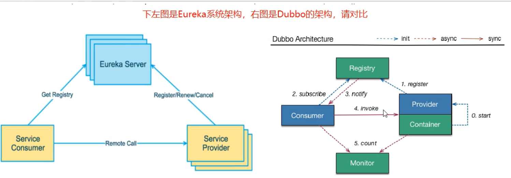
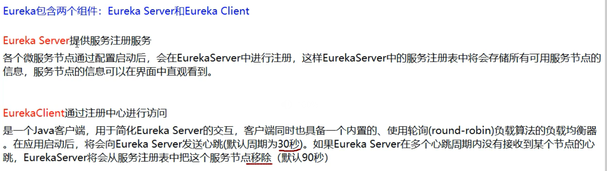

# SpringCloud:

## 0,SpringCloud升级,部分组件停用:

1,Eureka停用,可以使用zk作为服务注册中心

2,服务调用,Ribbon准备停更,代替为LoadBalance

3,Feign改为OpenFeign

4,Hystrix停更,改为resilence4j

 或者阿里巴巴的sentienl

5.Zuul改为gateway

6,服务配置Config改为 Nacos

7,服务总线Bus改为Nacos

# 环境搭建:

## 1,创建父工程,pom依赖

```java
  <!-- 统一管理jar包版本 -->
    <properties>
        <project.build.sourceEncoding>UTF-8</project.build.sourceEncoding>
        <maven.compiler.source>1.8</maven.compiler.source>
        <maven.compiler.target>1.8</maven.compiler.target>
        <junit.version>4.12</junit.version>
        <lombok.version>1.18.20</lombok.version>
        <log4j.version>1.2.17</log4j.version>
        <mysql.version>8.0.26</mysql.version>
        <druid.version>1.1.17</druid.version>
        <mybatis.spring.boot.version>2.2.0</mybatis.spring.boot.version>
    </properties>

    <!-- 子模块继承之后，提供作用：锁定版本+子module不用写groupId和version  -->
    <dependencyManagement><!--只是声明依赖，并不引入；类似重写:子类重写了此方法则用子类的-->
        <dependencies>
            <!--spring boot 2.5.4-->
            <dependency>
                <groupId>org.springframework.boot</groupId>
                <artifactId>spring-boot-dependencies</artifactId>
                <version>2.5.4</version>
                <type>pom</type>
                <scope>import</scope>
            </dependency>
            <!--spring cloud 2020.0.3-->
            <dependency>
                <groupId>org.springframework.cloud</groupId>
                <artifactId>spring-cloud-dependencies</artifactId>
                <version>2020.0.3</version>
                <type>pom</type>
                <scope>import</scope>
            </dependency>

            <!--spring cloud alibaba 2.2.1.RELEASE-->
            <dependency>
                <groupId>com.alibaba.cloud</groupId>
                <artifactId>spring-cloud-alibaba-dependencies</artifactId>
                <version>2.2.1.RELEASE</version>
                <type>pom</type>
                <scope>import</scope>
            </dependency>

            <dependency>
                <groupId>mysql</groupId>
                <artifactId>mysql-connector-java</artifactId>
                <version>${mysql.version}</version>
            </dependency>
            <dependency>
                <groupId>com.alibaba</groupId>
                <artifactId>druid</artifactId>
                <version>${druid.version}</version>
            </dependency>
            <dependency>
                <groupId>org.mybatis.spring.boot</groupId>
                <artifactId>mybatis-spring-boot-starter</artifactId>
                <version>${mybatis.spring.boot.version}</version>
            </dependency>
            <dependency>
                <groupId>junit</groupId>
                <artifactId>junit</artifactId>
                <version>${junit.version}</version>
            </dependency>
            <dependency>
                <groupId>log4j</groupId>
                <artifactId>log4j</artifactId>
                <version>${log4j.version}</version>
            </dependency>
            <dependency>
                <groupId>org.projectlombok</groupId>
                <artifactId>lombok</artifactId>
                <version>${lombok.version}</version>
                <optional>true</optional>
            </dependency>
        </dependencies>
    </dependencyManagement>

    <build>
        <plugins>
            <plugin>
                <groupId>org.springframework.boot</groupId>
                <artifactId>spring-boot-maven-plugin</artifactId>
                <configuration>
                    <fork>true</fork>
                    <addResources>true</addResources>
                </configuration>
            </plugin>
        </plugins>
    </build>
```

## 2,创建子模块,pay模块


### 1,子模块名字:

 cloud_pay_8001

### 2,pom依赖

```java
    <dependencies>
       <dependency>
            <groupId>org.springframework.boot</groupId>
            <artifactId>spring-boot-starter-web</artifactId>
        </dependency>

        
        <dependency>
            <groupId>org.mybatis.spring.boot</groupId>
            <artifactId>mybatis-spring-boot-starter</artifactId>
        </dependency>

       
        <dependency>
            <groupId>com.alibaba</groupId>
            <artifactId>druid-spring-boot-starter</artifactId>
            <version>1.1.17</version>
		</dependency>
       
        <dependency>
            <groupId>mysql</groupId>
            <artifactId>mysql-connector-java</artifactId>
        </dependency>

        <dependency>
            <groupId>org.springframework.boot</groupId>
            <artifactId>spring-boot-starter-jdbc</artifactId>
        </dependency>

        <!-- https://mvnrepository.com/artifact/org.springframework.boot/spring-boot-devtools -->
                <dependency>
                    <groupId>org.springframework.boot</groupId>
                    <artifactId>spring-boot-devtools</artifactId>
                    <scope>runtime</scope>
                    <optional>true</optional>
                </dependency>

        <!-- https://mvnrepository.com/artifact/org.projectlombok/lombok -->
        <dependency>
            <groupId>org.projectlombok</groupId>
            <artifactId>lombok</artifactId>
            <optional>true</optional>
        </dependency>

        <!-- https://mvnrepository.com/artifact/org.springframework.boot/spring-boot-starter-test -->
        <dependency>
            <groupId>org.springframework.boot</groupId>
            <artifactId>spring-boot-starter-test</artifactId>
            <scope>test</scope>
        </dependency>
    </dependencies>
    <properties>
        <maven.compiler.source>8</maven.compiler.source>
        <maven.compiler.target>8</maven.compiler.target>
    </properties>

</project>
```


### 3,创建application.yml

```yml
server:
  port: 8001
spring:
  application:
    name: cloud-payment-service
  datasource:
    # 当前数据源操作类型
    type: com.alibaba.druid.pool.DruidDataSource
    # mysql驱动类
    driver-class-name: com.mysql.cj.jdbc.Driver
    url: jdbc:mysql://localhost:3306/springcloud?useUnicode=true&characterEncoding=UTF-8&useSSL=false&serverTimezone=GMT%2B8
    username: root
    password: 1234
mybatis:
  mapper-locations: classpath*:mapper/*.xml
  type-aliases-package: Chang.entities
#    它一般对应我们的实体类所在的包，这个时候会自动取对应包中不包括包名的简单类名作为包括包名的别名。多个package之间可以用逗号或者分号等来进行分隔（value的值一定要是包的全）
```

### 4,主启动类

```java
@SpringBootApplication
public class PaymentMain8001 {
    public static void main(String[] args) {
        SpringApplication.run(PaymentMain8001.class,args);
    }
}
```


### 5,业务类

#### 1,sql

```java
CREATE TABLE `payment`(
	`id` bigint(20) NOT NULL AUTO_INCREMENT COMMENT 'ID',
	`serial` varchar(200) DEFAULT '',
	PRIMARY KEY (`id`)
) 
```


#### 2,实体类

```java
@Data
@AllArgsConstructor
@NoArgsConstructor
public class Payment {
    private Long id;
    private  String serial;
}

```

#### 3,.entity类

```java
@Data
@AllArgsConstructor
@NoArgsConstructor
public class CommonResult <T>{
    private Integer code;
    private String message;
    private T data;

    public CommonResult(Integer code, String message) {
        this(code,message,null);
    }
}

```

#### 4,dao层:

```java
@Mapperpublic interface PaymentDao {    public int create(Payment payment);    public Payment getPaymentById(@Param("id") Long id);}
```


#### 5,mapper配置文件类

​                **在resource下,创建mapper/PaymentMapper.xml**

```java
<?xml version="1.0" encoding="UTF-8" ?>
<!DOCTYPE mapper
        PUBLIC "-//mybatis.org//DTD Mapper 3.0//EN"
        "http://mybatis.org/dtd/mybatis-3-mapper.dtd">
<mapper namespace="Chang.dao.PaymentDao">
    <insert id="create" parameterType="Payment" useGeneratedKeys="true" keyProperty="id">
        insert into payment(serial) values(#{serial})
    </insert>

    <resultMap id="BaseResultMap" type="Chang.entities.Payment">
        <id column="id" property="id" jdbcType="BIGINT"/>
        <result column="serial" property="serial" jdbcType="VARCHAR"/>
    </resultMap>
    <select id="getPaymentById" parameterType="Long" resultMap="BaseResultMap">
        select * from payment where id=#{id};
    </select>
</mapper>

```


#### 6,写service和serviceImpl

```java
public interface PaymentService {
    public int create(Payment payment);

    public Payment getPaymentById(@Param("id") Long id);
}

```

```java
@Service
public class PaymentServiceIml  implements  PaymentService{
    @Resource
    private  PaymentDao paymentDao;

    public int create(Payment payment){
       return paymentDao.create(payment);
    }

    public Payment getPaymentById( Long id){
       return  paymentDao.getPaymentById(id);
    }
}
```


#### 7,controller

```java
@RestController
@Slf4j
public class PaymentController {
    @Resource
    private PaymentService paymentService;

    @PostMapping(value = "/payment/create")//写操作
    public CommonResult create(@RequestBody Payment payment){
        int result = paymentService.create(payment);
        log.info("************插入结果:"+result);
        if (result>0){
            return new CommonResult(200,"插入数据成功！",result);
        }else
            return new CommonResult(444,"插入数据失败！！！",null);
    }

    @GetMapping(value = "/payment/get/{id}")//写操作
    public CommonResult getPaymentById(@PathVariable("id") Long id){
        Payment payment = paymentService.getPaymentById(id);
        log.info("************插入结果:"+payment);
        if (payment!=null){
            return new CommonResult(200,"查询成功！",payment);
        }else
            return new CommonResult(444,"没有对应记录！！！查询id:"+id,null);
    }
}
```


## 3,热部署:

```java
<dependency>
                    <groupId>org.springframework.boot</groupId>
                    <artifactId>spring-boot-devtools</artifactId>
                    <scope>runtime</scope>
                    <optional>true</optional>
                </dependency>
```

```ABAP
在父工程中添加插件，前面已做好！
```


## 4,order模块


### **1,pom**

```java
    <dependencies>
        <dependency>
            <groupId>org.springframework.boot</groupId>
            <artifactId>spring-boot-starter-web</artifactId>
        </dependency>


        <dependency>
            <groupId>org.springframework.boot</groupId>
            <artifactId>spring-boot-devtools</artifactId>
            <scope>runtime</scope>
            <optional>true</optional>
        </dependency>
        <dependency>
            <groupId>org.projectlombok</groupId>
            <artifactId>lombok</artifactId>
            <optional>true</optional>
        </dependency>
        <dependency>
            <groupId>org.springframework.boot</groupId>
            <artifactId>spring-boot-starter-test</artifactId>
            <scope>test</scope>
        </dependency>
    </dependencies>
```


### **2,yml配置文件**

```java
server:
  port: 80
      
开启多个Application时：解决Unable to start LiveReload server 只需加如下代码
spring:
  devtools:
    livereload:
      port: 35730
```


### **3,主启动类**

```java
@SpringBootApplication
public class OrderMain80 {
    public static void main(String[] args) {
        SpringApplication.run(OrderMain80.class, args);
    }
}
```

### **4.复制pay模块的实体类,entity类**

### **5,写controller类**

 因为这里是消费者类,主要是消费,那么就没有service和dao,需要调用pay模块的方法

 并且这里还没有微服务的远程调用,那么如果要调用另外一个模块,则需要使用基本的api调用

使用RestTemplate调用pay模块,

​    


 将restTemplate注入到容器

```java
@Configurationpublic class ApplicationContextConfig {    @Bean//相当于applicationContext.xml <bean id="" class="">    public RestTemplate getRestTemple(){        return new RestTemplate();    }}
```

编写controller:

```java
@RestController@Slf4jpublic class OrderController {    private static final String PAYMENT_URL="http://localhost:8001";    @Resource    private RestTemplate restTemplate;    @GetMapping("/consumer/payment/create")    public CommonResult<Payment> create(Payment payment){        return   restTemplate.postForObject(PAYMENT_URL+"/payment/create",payment,CommonResult.class);    }    @GetMapping("/consumer/payment/get/{id}")    public CommonResult<Payment> getPayment(@PathVariable("id") Long id){        return restTemplate.getForObject(PAYMENT_URL+"/payment/get/"+id,CommonResult.class);    }}
```

### 6.没有数据库配置报错  

```java
Consider the following: If you want an embedded database (H2, HSQL or Derby), please put it on the classpath....... 尝试多种方法都无用只需在右边侧边栏Maven中找到此moudle的Lifecycle  clean一下即可     
```

###  7.查看信息和插入信息的网址

```java
http://localhost:8001/payment/get/?http://localhost/consumer/payment/create?serial=?
```

### 8.查看结果并修改bug

```ABAP
网页插入成功后，但数据库中只有id没有内容只需在8001的PaymentController加@RequestBody注解。(注：前面我已加过！！！)
```


## 5,重构,

新建一个模块,将重复代码抽取到一个公共模块中

### 1,创建commons模块

### 2,抽取公共pom

```java
<dependencies>
        <dependency>
            <groupId>org.springframework.boot</groupId>
            <artifactId>spring-boot-devtools</artifactId>
            <scope>runtime</scope>
            <optional>true</optional>
        </dependency>
        <dependency>
            <groupId>org.projectlombok</groupId>
            <artifactId>lombok</artifactId>
            <optional>true</optional>
        </dependency>
        <dependency>
            <groupId>cn.hutool</groupId>
            <artifactId>hutool-all</artifactId>
            <version>5.1.0</version>
        </dependency>
    </dependencies>
```


### 3,entity和实体类(entities包下的两个文件)放入commons中

s

### 4,使用mavne,将commone模块打包(install),

 其他模块引入commons

```ABAP
<!--引入自己定义的api通用包，可以使用Payment支付Entity--><dependency>	<groupId>springcloud</groupId>  //与的最先创建的pom.xml中头文件下的的groupId相同    <artifactId>cloud-api-commons</artifactId>    <version>${project.version}</version></dependency>
```


# 2,服务注册与发现

## 6,Eureka:

前面我们没有服务注册中心,也可以服务间调用,为什么还要服务注册?

当服务很多时,单靠代码手动管理是很麻烦的,需要一个公共组件,统一管理多服务,包括服务是否正常运行,等

Eureka用于**==服务注册==**,目前官网**已经停止更新**

​    






### **单机版eureka:**

#### **1,创建项目cloud4_eureka_server_7001**

#### **2,引入pom依赖**

 eurka最新的依赖变了


#### 3,配置文件:

```java
server:
  port: 7001

eureka:
  instance:
    hostname: localhost #eureka服务端的实例名称
  client:
    #false表示不向注册中心注册自己
    register-with-eureka: false
    #false表示自己端就是注册中心，我的职责就是维护服务实例，并不需要去检索服务
    fetch-registry: false
    service-url:
      #设置与Eureka Server交互的地址查询服务和注册服务都需要依赖这个地址
      defaultZ4 one: http://${eureka.instance.hostname}:${server.port}/eureka/


```


#### 4,主启动类

```java
@SpringBootApplication
@EnableEurekaServer
public class EurekaMain7001 {
    public static void main(String[] args) {
        SpringApplication.run(EurekaMain7001.class,args);
    }
}

```


#### **5,此时就可以启动当前项目了**

```java
http://localhost:7001
DS Replicas下显示No instances available表示当前没有服务注册进来
```


#### **6,其他服务注册到eureka:**

在前两个订单模块和客户模块中加入eureka:

##### 1.主启动类上加注解

```ABAP
@EnableEurekaClient    
表示当前是eureka客户端
```

##### 2.pom中添加eureka客户端

```java
<!--eureka-client-->
        <dependency>
            <groupId>org.springframework.cloud</groupId>
            <artifactId>spring-cloud-starter-netflix-eureka-client</artifactId>
        </dependency>
```

##### 3,配置文件中添加:

```java
eureka:
  client:
    #表示是否将自己注册进EurekaServer默认为true
    register-with-eureka: true
    #是否从EurekaServer抓取已有的注册信息，默认为true。单节点无所谓，集群必须设置为true才能配合ribbon使用负载均衡
    fetch-registry: true
    service-url:
      defaultZone: http://localhost:7001/eureka

```

##### 4.前启动7001模块

再启动另外两个模块，就可验证两个模块都被加入进来


### 集群版eureka:

#### 集群原理:


 ```java
1,就是pay模块启动时,注册自己,并且自身信息也放入eureka
    2.order模块,首先也注册自己,放入信息,当要调用pay时,先从eureka拿到pay的调用地址
        3.通过HttpClient调用
        并且还会缓存一份到本地,每30秒更新一次
 ```


**集群构建原理:**

 互相注册


#### **构建新erueka项目**

名字:cloud_eureka_server_7002

##### 1,pom文件:

 粘贴7001的即可

##### 2,配置文件:

找到 C:\Windows\System32\drivers\etc路径下的hosts文件

本来是127.0.0.1       activate.navicat.com

```ABAP
修改为：
127.0.0.1       eureka7001.com
127.0.0.1       eureka7002.com

如修改失败，先把此文件拉到桌面修改，在重新放回去
```

首先修改之前的7001的eureka项目,因为多个eureka需要互相注册

```java
server:
  port: 7001

eureka:
  instance:
    hostname: eureka7001.com #eureka服务端的实例名称
  client:
    #false表示不向注册中心注册自己
    register-with-eureka: false
    #false表示自己端就是注册中心，我的职责就是维护服务实例，并不需要去检索服务
    fetch-registry: false
    service-url:
      #设置与Eureka Server交互的地址查询服务和注册服务都需要依赖这个地址
      defaultZone: http://eureka7002.com:7002/eureka/
```

然后修改7002

​            **7002也是一样的,只不过端口和地址改一下**

##### 3,主启动类:

 复制7001的即可

##### 4,然后启动7001,7002即可

**

#### 将pay,order模块注册到eureka集群中:

##### 1,只需要修改配置文件即可:


##### 2,两个模块都修改上面的都一样即可

 然后启动两个模块

 要先启动7001,7002,然后是pay模块8001,然后是order(80)

### 3,将pay模块也配置为集群模式:

#### 0,创建新模块,8002

 名称: cloud5_pay_8002

#### 1,添加端口号服务

```java
 在8001的PaymentController中添加：
@Value("${server.port}")
    private String  serverPort;

并输出端口号：return new CommonResult(200,"插入数据成功,serverPort:"+serverPort,result);
			return new CommonResult(200,"查询成功,serverPort:"+serverPort,payment);

```


#### 2.将整个8001Moudle下的东西全部复制

#### 3.修改yml的端口号

 端口修改一下,改为8002

 服务名称不用改,用一样的

#### 4.按顺序启动程序

```ABAP
7001 7002 8001 8002 80
```

#### 5添加负载均衡

发现order模块访问不了8002端口

 虽然我们是使用RestTemplate访问的微服务,但是也可以负载均衡的


**注意这样还不可以,需要让RestTemplate开启负载均衡注解,还可以指定负载均衡算法,默认轮询**

```ABAP
在order模块下的 ApplicationContextConfig中bean注解下
添加@LoadBalanced注解    ===>//使用LoadBalanced注解赋予RestTemplate负载均衡的能力
```

### 4,修改服务主机名和ip在eureka的web上显示

比如修改pay模块

#### 1,修改配置文件:


### 5,eureka服务发现:


以pay模块为例

#### 1,首先添加一个注解,在controller中


​    然后再添加

```java
  public Object discovery(){
        List<String> services = discoveryClient.getServices();
        for (String element : services) {
            log.info("*****element:"+element);
        }
        List<ServiceInstance> instances = discoveryClient.getInstances("ClOUD-PAYMENT-SERVICE");
        for (ServiceInstance instance : instances) {
            log.info(instance.getInstanceId()+"\t"+instance.getHost()+"\t"+instance.getPort()+"\t"+instance.getUri());
        }
        return this.discoveryClient;
    }
```


#### 2,在主启动类上添加一个注解


**然后重启8001.访问/payment/discover**y

### 6,Eureka自我保护:


**eureka服务端配置:**


​            **设置接受心跳时间间隔**

**客户端(比如pay模块):**


**此时启动erueka和pay.此时如果直接关闭了pay,那么erueka会直接删除其注册信息**

