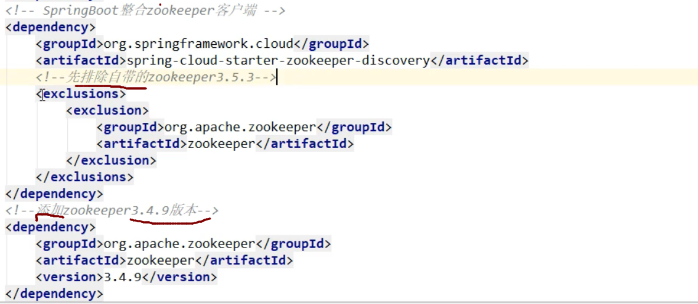
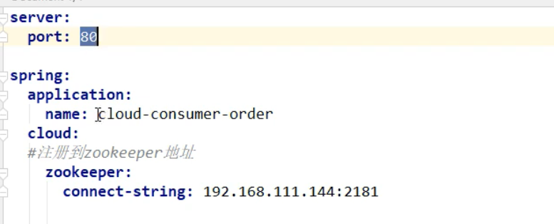

可参考：https://blog.csdn.net/qq_41211642/article/details/104821619)

## 7,Zookeeper服务注册与发现:

### 1,启动Zookeeper

### 2,创建新的pay模块,

单独用于注册到zk中

名字 : cloud6_pay_8004

#### 1.pom依赖

```java
<dependencies>
    <dependency>
        <groupId>springcloud</groupId>
        <artifactId>cloud3-api-commons</artifactId>
        <version>${project.version}</version>
    </dependency>

        <!-- SpringBoot整合zookeeper客户端-->
    <dependency>
            <groupId>org.springframework.cloud</groupId>
            <artifactId>spring-cloud-starter-zookeeper-discovery</artifactId>
    </dependency>

    <dependency>
        <groupId>org.springframework.boot</groupId>
        <artifactId>spring-boot-starter-web</artifactId>
    </dependency>

    <dependency>
        <groupId>org.springframework.boot</groupId>
        <artifactId>spring-boot-devtools</artifactId>
        <scope>runtime</scope>
        <optional>true</optional>
    </dependency>
        <dependency>
            <groupId>org.projectlombok</groupId>
            <artifactId>lombok</artifactId>
            <optional>true</optional>
        </dependency>
        <dependency>
            <groupId>org.springframework.boot</groupId>
            <artifactId>spring-boot-starter-test</artifactId>
            <scope>test</scope>
        </dependency>

    </dependencies>
```


#### 2,配置文件

```java
#8004表示注册到zookeeper服务器的支付服务提供者端口号
server:
  port: 8004

#服务别名----注册zookeeper到注册中心名称
spring:
  application:
    name: cloud-provider-payment
  cloud:
    zookeeper:
      connect-string: 192.168.88.131:2181 #写当前电脑的IP地后跟:2181 

```


#### 3,主启动类

```java
@SpringBootApplication
@EnableDiscoveryClient//该注解用于向使用corsul或名zookeeper作为注册中心时注册服务
public class PaymentMain8004 {
    public static void main(String[] args) {
        SpringApplication.run(PaymentMain8004.class, args);
    }
}
```


#### 4,controller

```java
@RestController
@Slf4j
public class PaymentController {
    @Value("${server.port}")
    private String serverPort;

    @RequestMapping(value = "/payment/zk")
    public String paymentzk(){
        return "springcloud with zookeeper："+serverPort+"\t"+ UUID.randomUUID().toString();
    }
}
```


#### 5,然后就可以启动(版本低的汇报错误)

**此时启动,会报错,因为jar包与我们的zk版本不匹配**

解决:
修改pom文件,改为与我们zk版本匹配的jar包



**此时8004就注册到zk中了**

```java
我们在zk上注册的node是临时节点,当我们的服务一定时间内没有发送心跳
        那么zk就会`将这个服务的node删除了
```

#### 6.测试

```ABAP
zookeeper中bin目录下先启动zkServer.cmd  然后启动zkCli.cmd  （我用的windows版本） 
启动8004 输入http://localhost:8004/payment/zk  下面显示内容即为成功！！！
```


### 3,创建order消费模块注册到zk

#### 1,创建项目

名字: cloud7-consumerzk-order80

#### 2.pom与8004相同

#### 3,配置文件

```java
#80表示注册到zookeeper服务器的支付服务提供者端口号
server:
  port: 80

#服务别名----注册zookeeper到注册中心名称
spring:
  application:
    name: cloud-consumer-order
  cloud:
    zookeeper:
      connect-string: 192.168.0.104:2181
```

#### 4主启动类:

```java
@SpringBootApplication
@EnableDiscoveryClient
public class OrderZKMain80 {
    public static void main(String[] args) {
        SpringApplication.run(OrderZKMain80.class, args);
    }
}
```

#### 5.RestTemolate

```java
@Configuration
public class ApplicationContextConfig {
    @Bean
    @LoadBalanced
    public RestTemplate getRestTemplate(){
        return new RestTemplate();
    }
}
```

#### 6,controller

```java
@RestController
@Slf4j
public class OrderZKController {
    public static final String INVOKE_URL = "http://cloud-provider-payment";
    @Resource
    private RestTemplate restTemplate;

    @GetMapping(value = "/consumer/payment/zk")
    public String paymentInfo() {

        String result = restTemplate.getForObject(INVOKE_URL + "/payment/zk",String.class);
        return result;
    }
}
```

**然后启动即可注册到zk**

```ABAP
访问地址  http://localhost/consumer/payment/zk
```

#### 8,集群版zk注册:

只需要修改配置文件:



这个connect-string指定多个zk地址即可

connect-string: 1.2.3.4,2.3.4.5