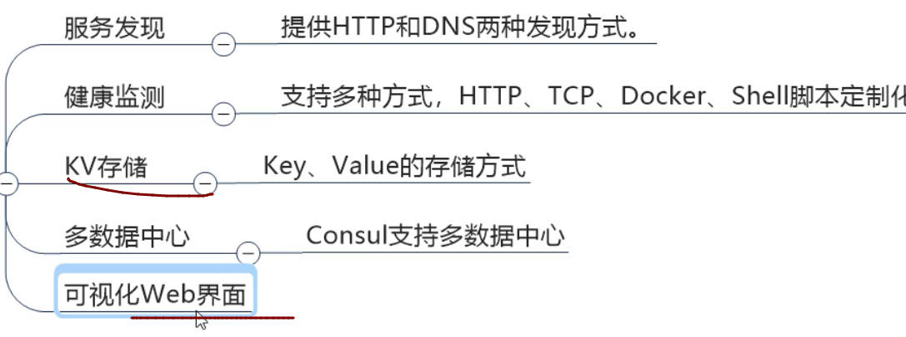
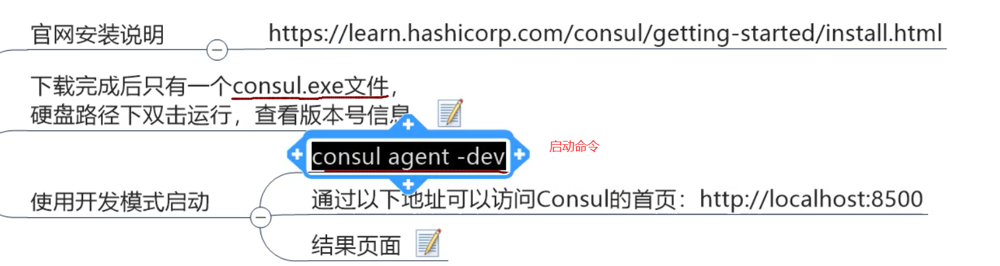
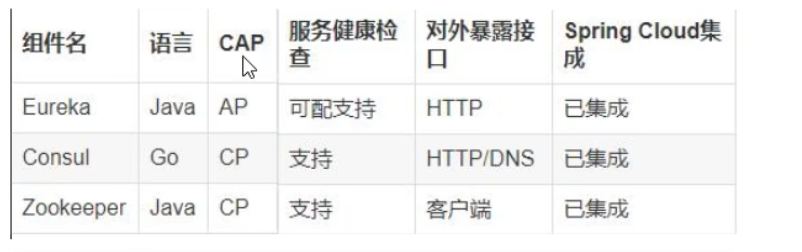
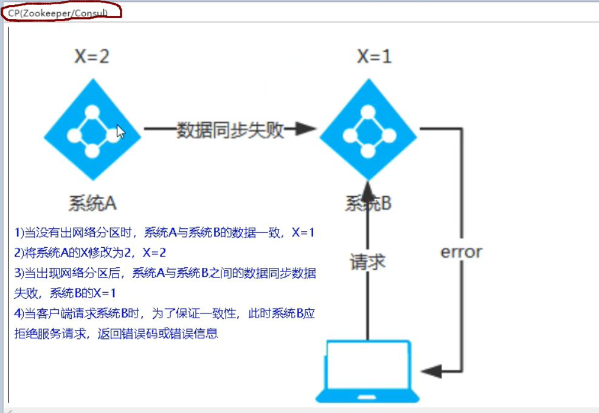

## 8,Consul:




### 1,按照consul

需要下载一个安装包



启动是一个命令行界面,需要输入consul agen-dev启动

### 2,创建新的pay模块,8006

#### 1,项目名字

cloud8-providerconsul-payment8006

#### 2,pom依赖

```java
<dependencies>
    <!--springcloud consul-server-->
    <dependency>
        <groupId>org.springframework.cloud</groupId>
        <artifactId>spring-cloud-starter-consul-discovery</artifactId>
    </dependency>
    <dependency>
        <groupId>org.springframework.boot</groupId>
        <artifactId>spring-boot-starter-web</artifactId>
    </dependency>
    <dependency>
        <groupId>org.springframework.boot</groupId>
        <artifactId>spring-boot-starter-actuator</artifactId>
    </dependency>
    <!--日常通用jar包-->
    <dependency>
        <groupId>org.springframework.boot</groupId>
        <artifactId>spring-boot-devtools</artifactId>
        <scope>runtime</scope>
        <optional>true</optional>
    </dependency>
    <dependency>
        <groupId>org.projectlombok</groupId>
        <artifactId>lombok</artifactId>
        <optional>true</optional>
    </dependency>
    <dependency>
        <groupId>org.springframework.boot</groupId>
        <artifactId>spring-boot-starter-test</artifactId>
        <scope>test</scope>
    </dependency>
</dependencies>
```


#### 3,配置文件

```java
###consull服务端口号
server:
  port: 8006

spring:
  application:
    name: consul-provider-payment
  ###consul注册中心地址
  cloud:
    consul:
      host: localhost
      port: 8500
      discovery:
        #hostname: 127.0.0.1
        service-name: ${spring.application.name}  #对外暴露服务名称

```

#### 4,主启动类

```java
@SpringBootApplication
@EnableDiscoveryClient
public class PaymentMain8006 {

    public static void main(String[] args) {
        SpringApplication.run(PaymentMain8006.class,args);
    }
}
```

#### 5,controller

```java
@RestController
@Slf4j
public class PaymentController {

    @Value("${server.port}")
    private String serverPort;

    @GetMapping(value = "/payment/consul")
    public String paymentConsul(){
        return "springcloud with consul："+serverPort+"\t"+ UUID.randomUUID().toString();
    }
}  //与zookeeper中controller基本一样
```

#### 6,启动服务

```java
http://localhost:8500/ui/dc1/services  显示两个服务即为成功！
http://localhost:8006/payment/consul   测试功能
```

### 3,创建新order模块

cloud9-consumerconsul-order80

#### 1,pom文件与8006相同

#### 2,配置文件

```java
### consul服务端口号
server:
  port: 80

spring:
  application:
    name: cloud-consumer-order
  ###consul服务注册中心
  cloud:
    consul:
      host: localhost
      port: 8500
      discovery:
        #hostname: 127.0.0.1
        service-name: ${spring.application.name}

```

#### 3,主启动类

```java
@SpringBootApplication
@EnableDiscoveryClient
public class OrderConsulMain80 {
    public static void main(String[] args) {
        SpringApplication.run(OrderConsulMain80.class, args);
    }
}
```

#### 4,RestTemplate注册

```java
@Configuration
public class ApplicationContextConfig {
    @Bean
    @LoadBalanced
    public RestTemplate getRestTemplate(){
        return new RestTemplate();
    }
}配置类注册
```

#### 5,controller

```java
@RestController
@Slf4j
public class OrderConsulController {
    public static final String INVOKE_URL = "http://consul-provider-payment";//url要与提供者yml中名字一致
    @Resource
    private RestTemplate restTemplate;

    @GetMapping(value = "/consumer/payment/consul")
    public String paymentInfo(){
        String result = restTemplate.getForObject(INVOKE_URL + "/payment/consul", String.class);
        return result;
    }
}
```

#### 6,启动服务,测试

```ABAP
http://localhost:8500/ui/dc1/services
http://localhost/consumer/payment/consul
```

## 9,三个注册中心的异同:




