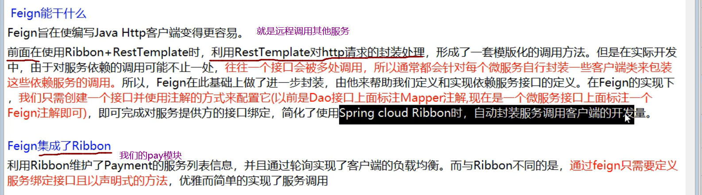
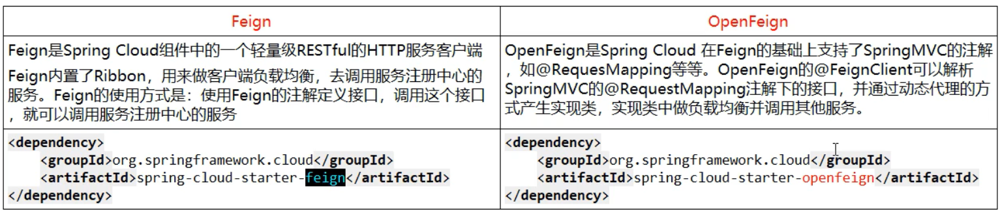
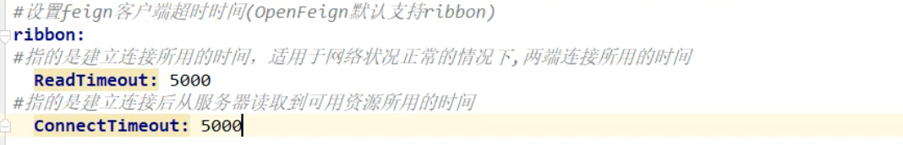
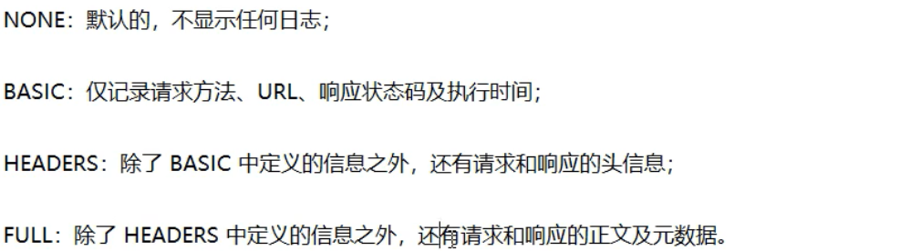
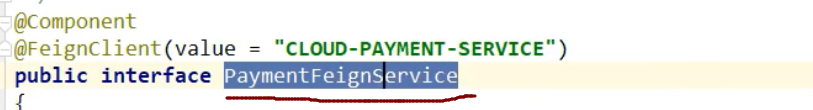

## 11,OpenFeign


**是一个声明式的web客户端,只需要创建一个接口,添加注解即可完成微服务之间的调用**



==就是A要调用B,Feign就是在A中创建一个一模一样的B对外提供服务的的接口,我们调用这个接口,就可以服务到B==

### **Feign与OpenFeign区别**



### 使用OpenFeign

```java
之前的服务间调用,我们使用的是ribbon+RestTemplate
        现在改为使用Feign
```

#### 1,新建一个order项目,用于feign测试

名字cloud10-consumer-feign-order80

#### 2,pom文件

```java
<dependencies>
        <!--openfeign-->
        <dependency>
            <groupId>org.springframework.cloud</groupId>
            <artifactId>spring-cloud-starter-openfeign</artifactId>
        </dependency>
        <!--eureka client-->
        <dependency>
            <groupId>org.springframework.cloud</groupId>
            <artifactId>spring-cloud-starter-netflix-eureka-client</artifactId>
        </dependency>
        <!--引入自定义的api通用包，可以使用Payment支付Entity-->
        <dependency>
            <groupId>com.atguigu.springcloud</groupId>
            <artifactId>cloud-api-commons</artifactId>
            <version>${project.version}</version>
        </dependency>
        <!--web-->
        <dependency>
            <groupId>org.springframework.boot</groupId>
            <artifactId>spring-boot-starter-web</artifactId>
        </dependency>
        <dependency>
            <groupId>org.springframework.boot</groupId>
            <artifactId>spring-boot-starter-actuator</artifactId>
        </dependency>
        <!--一般基础通用配置-->
        <dependency>
            <groupId>org.springframework.boot</groupId>
            <artifactId>spring-boot-devtools</artifactId>
            <scope>runtime</scope>
            <optional>true</optional>
        </dependency>
        <dependency>
            <groupId>org.projectlombok</groupId>
            <artifactId>lombok</artifactId>
            <optional>true</optional>
        </dependency>
        <dependency>
            <groupId>org.springframework.boot</groupId>
            <artifactId>spring-boot-starter-test</artifactId>
            <scope>test</scope>
        </dependency>
    </dependencies>

```


#### 3,配置文件

<font color='red'>#3.X以后文件中没有Ribbon，官方文件推荐使用loadbalancer</font>

```java
server:
  port: 80

eureka:
  client:
    register-with-eureka: false
    service-url:
      defaultZone: http://eureka7001.com:7001/eureka/,http://eureka7002.com:7002/eureka


额外添加如下：
spring:
  cloud:
    loadbalancer:
      ribbon:
        enabled: true
```

#### 4,主启动类

```java
@SpringBootApplication
@EnableFeignClients//开启Feign
public class OrderFeignMain80 {
    public static void main(String[] args) {

        SpringApplication.run(OrderFeignMain80.class, args);
    }

}
```


#### 5,fegin需要调用的其他的服务的接口

service包下的接口

```java
@Component
@FeignClient(value = "CLOUD-PAYMENT-SERVICE")//指定这个接口对应要调用的微服务的服务名称
public interface PaymentFeignService {
    @GetMapping(value = "/payment/get/{id}")    //哪个地址
    CommonResult<Payment> getPaymentById(@PathVariable("id") Long id);
}

```

#### 6,controller

```java
@RestController
@Slf4j
public class OrderFeignController {
    @Resource
    private PaymentFeignService paymentFeignService;

    @GetMapping(value = "/consumer/payment/get/{id}")
    public CommonResult<Payment> getPaymentById(@PathVariable("id") Long id){
        return paymentFeignService.getPaymentById(id);
    }
}
```

#### 7测试:

启动两个erueka(7001,7002)

启动两个pay(8001,8002)

启动当前的order模块

```ABAP
http://eureka7002.com:7002
http://localhost/consumer/payment/get/31
```


### OpenFeign超时机制:

==OpenFeign默认等待时间是1秒,超过1秒,直接报错==

#### 1,设置超时时间,修改配置文件:

**<font color='red'>3.x以后默认已经配置timeout,无需添加如下代码</font>**

**因为OpenFeign的底层是ribbon进行负载均衡,所以它的超时时间是由ribbon控制**



### OpenFeign日志:


**OpenFeign的日志级别有:**


#### 1,使用OpenFeign的日志:

**实现在配置类中添加OpenFeign的日志类**

```java
@Configuration
public class FeignConfig {
    @Bean
    Logger.Level feignLoggerLevel(){
        return Logger.Level.FULL;
    }
}
```


#### 2,为指定类设置日志级别:



**配置文件中:**

```ABAP
logging:
  level:
    #feign日志以什么级别监控哪个接口(选中PaymentFeignService 右键copy路径)	
    Chang.service.PaymentFeignService: debug
```

#### 3,启动服务调用一个页面

即可在控制台查看信息

