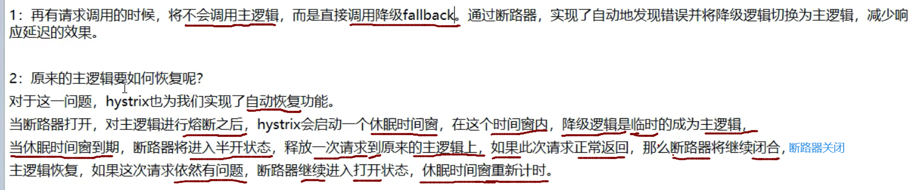
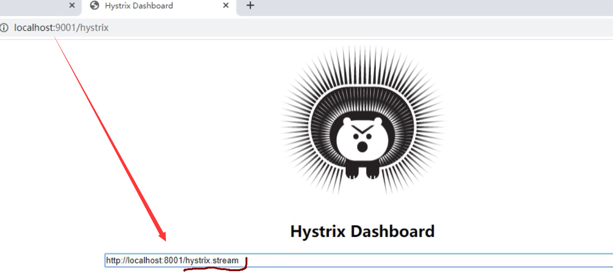

# 4,服务降级:

## 12,Hystrix服务降级


### hystrix中的重要概念:

#### 1,服务降级

**比如当某个服务繁忙,不能让客户端的请求一直等待,应该立刻返回给客户端一个备选方案**

服务降级在业务中就是指正常流程跑不通,-先记录下来,然后再用程序去根据这些数据做补救

#### 2,服务熔断

**当某个服务出现问题,卡死了,不能让用户一直等待,需要关闭所有对此服务的访问**

​            **然后调用服务降级**

#### 3,服务限流

**限流,比如秒杀场景,不能访问用户瞬间都访问服务器,限制一次只可以有多少请求**

### 使用hystrix,服务降级:

#### 1,创建带降级机制的pay模块 :

名字: cloud11-hystrix-pay-8007

##### 2,pom文件

```java
<dependencies>
        <!--hystrix-->
        <dependency>
            <groupId>org.springframework.cloud</groupId>
            <artifactId>spring-cloud-starter-netflix-hystrix</artifactId>
            <version>2.2.9.RELEASE</version>
        </dependency>
        <!--eureka client-->
        <dependency>
            <groupId>org.springframework.cloud</groupId>
            <artifactId>spring-cloud-starter-netflix-eureka-client</artifactId>
        </dependency>
        <!--引入自定义的api通用包，可以使用Payment支付Entity-->
        <dependency>
            <groupId>springcloud</groupId>
            <artifactId>cloud3-api-commons</artifactId>
            <version>${project.version}</version>
        </dependency>
        <!--web-->
        <dependency>
            <groupId>org.springframework.boot</groupId>
            <artifactId>spring-boot-starter-web</artifactId>
        </dependency>
        <dependency>
            <groupId>org.springframework.boot</groupId>
            <artifactId>spring-boot-starter-actuator</artifactId>
        </dependency>
        <!--一般基础通用配置-->
        <dependency>
            <groupId>org.springframework.boot</groupId>
            <artifactId>spring-boot-devtools</artifactId>
            <scope>runtime</scope>
            <optional>true</optional>
        </dependency>
        <dependency>
            <groupId>org.projectlombok</groupId>
            <artifactId>lombok</artifactId>
            <optional>true</optional>
        </dependency>
        <dependency>
            <groupId>org.springframework.boot</groupId>
            <artifactId>spring-boot-starter-test</artifactId>
            <scope>test</scope>
        </dependency>
    </dependencies>
```


##### 3,配置文件

```java
server:
  port: 8001

spring:
  application:
    name: cloud-provider-hystrix-payment
eureka:
  client:
    register-with-eureka: true
    fetch-registry: true
    service-url:
      #defaultZone: http://eureka7002.com:7002/eureka/  #集群指向其他eureka
      defaultZone: http://eureka7001.com:7001/eureka/  #单机就是7001自己

```

##### 4,主启动类

```java
@SpringBootApplication@EnableEurekaClientpublic class PaymentHystrixMain8001 {    public static void main(String[] args) {        SpringApplication.run(PaymentHystrixMain8001.class, args);    }}
```


##### 5,service

```java
@Service
public class PaymentService {
    //正常访问，ok
    public String paymentInfo_OK(Integer id){
        return "线程池:"+Thread.currentThread().getName()+"paymentInfo_OK,id:"+id+"\t"+"O(∩_∩)O哈哈~";
    }

    public String paymentInfo_TimeOut(Integer id){//这个方法是测试熔断的方法,这里会超时3秒,测试是否熔断
        int timeNumber=3;
       try {
                   TimeUnit.SECONDS.sleep(timeNumber);
               } catch (InterruptedException e) {
                   e.printStackTrace();
               }
        return "线程池:"+Thread.currentThread().getName()+"paymentInfo_TimeOut,id:"+id+"\t"+"┭┮﹏┭┮"+"耗时(秒):"+timeNumber;
    }
}
```

##### 6.controller

```java
@RestController
@Slf4j
public class PaymentController {
    @Resource
    private PaymentService paymentService;

    @Value("${server.port}")
    private  String severPort;

    @GetMapping("/payment/hystrix/ok/{id}")
    public String paymentInfo_OK(@PathVariable("id") Integer id){

        String result = paymentService.paymentInfo_OK(id);
        log.info("@@@@@@@@@@result:"+result);
        return result;

    }

    @GetMapping("/payment/hystrix/timeout/{id}")
    public String paymentInfo_TimeOut(@PathVariable("id") Integer id){

        String result = paymentService.paymentInfo_TimeOut(id);
        log.info("@@@@@@@@@@result:"+result);
        return result;

    }
}

```

##### 7,先测试:

```java
http://localhost:8001//payment/hystrix/ok/31
http://localhost:8001/payment/hystrix/timeout/31
此时使用压测工具,并发20000个请求,请求会延迟的那个方法,
        压测中,发现,另外一个方法并没有被压测,但是我们访问它时,却需要等待
        这就是因为被压测的方法它占用了服务器大部分资源,导致其他请求也变慢了
```

##### 8,先不加入hystrix,

#### 2,创建带降级的order模块:

##### 1,名字:  cloud12-feign-hystrix-order-80

##### 2,pom

```java
相对于8007多了一个
<!--openfeign-->
        <dependency>
            <groupId>org.springframework.cloud</groupId>
            <artifactId>spring-cloud-starter-openfeign</artifactId>
        </dependency>
```


##### 3,配置文件

```java
server:
  port: 80

eureka:
  client:
    register-with-eureka: true
    fetch-registry: true
    service-url:
      #defaultZone: http://eureka7002.com:7002/eureka/  #集群指向其他eureka
      defaultZone: http://eureka7001.com:7001/eureka/  #单机就是7001自己

```

##### 4,主启动类

```java
@SpringBootApplication
@EnableFeignClients
public class OrderHystrixMain80 {
    public static void main(String[] args) {
            SpringApplication.run(OrderHystrixMain80.class,args );
        }
}
```


##### 5,远程调用pay模块的接口:

**<font color='blue'>Feign：微服务接口+@FeignClient</font>**

```JAVA
@Component
@FeignClient(value = "CLOUD-PROVIDER-HYSTRIX-PAYMENT")
public interface PaymentHystrixService {

    @GetMapping("/payment/hystrix/ok/{id}")
    public String paymentInfo_OK(@PathVariable("id") Integer id);

    @GetMapping("/payment/hystrix/timeout/{id}")
    public String paymentInfo_TimeOut(@PathVariable("id") Integer id);

}
```


##### 6,controller:

```java
@RestController
@Slf4j
public class OrderHystrixController {
    @Resource
    private PaymentHystrixService paymentHystrixService;

    @GetMapping("/consumer/payment/hystrix/ok/{id}")
    public String paymentInfo_OK(@PathVariable("id") Integer id){
        String result = paymentHystrixService.paymentInfo_OK(id);
        return  result;

    }

    @GetMapping("/consumer/payment/hystrix/timeout/{id}")
    public String paymentInfo_TimeOut(@PathVariable("id") Integer id){
        String result = paymentHystrixService.paymentInfo_TimeOut(id);
        return  result;
    }
}
```


##### 7,测试

 启动order模块,访问pay

```ABAP
http://localhost/consumer/payment/hystrix/ok/31
```

 再次压测2万并发,发现order访问也变慢了


**解决:**


##### 

#### 3,配置服务降级:

##### 1,修改8007pay模块

###### 1,为service的指定方法(会延迟的方法)添加@HystrixCommand注解

```java
//表示当需要发生服务降级时,调用此方法,相当于降级到此方法(paymentInfo_TimeOutHandler)
    @HystrixCommand(fallbackMethod = "paymentInfo_TimeOutHandler", commandProperties ={
            @HystrixProperty(name="execution.isolation.thread.timeoutInMilliseconds", value="3000")
    })//这里表示,调用此方法的线程,最多只等待?秒中,如果?秒钟没有响应,触发降级,调用指定方法
    public String paymentInfo_TimeOut(Integer id){//这个方法是测试熔断的方法,这里会超时?秒,测试是否熔断
        int timeNumber=5;
        //int age=10/0;
       try {
                   TimeUnit.SECONDS.sleep(timeNumber);
               } catch (InterruptedException e) {
                   e.printStackTrace();
               }
        return "线程池:"+Thread.currentThread().getName()+"paymentInfo_TimeOut,id:"+id+"\t"+"O(∩_∩)O哈哈~"+"耗时(秒):"+timeNumber;
    }

    public String paymentInfo_TimeOutHandler (Integer id) {//表示当需要发生服务降级时,调用此方法,相当于降级到此方法
        return "/(ToT)/调用支付接口超时或异常: \t" + "\t当前线程池名字" + Thread.currentThread().getName();
    }
```


###### 2,主启动类上,添加激活hystrix的注解

```java
@EnableHystrix
```

###### 3,触发异常


**可以看到,也触发了降级**

##### 2,修改order模块,进行服务降级

一般服务降级,都是放在客户端(order模块),


###### 1,修改配置文件:

```java
feign:
  hystrix:
    enable: true
```

###### **2,主启动类添加直接,启用hystrix:**

```
@EnableHystrix
```

###### 3,修改controller,添加降级方法什么的

```java
   @GetMapping("/consumer/payment/hystrix/timeout/{id}")
    @HystrixCommand(fallbackMethod = "paymentTimeoutFallbackMethod", commandProperties ={
            @HystrixProperty(name="execution.isolation.thread.timeoutInMilliseconds", value="1500")
    })
    public String paymentInfo_TimeOut(@PathVariable("id") Integer id){
        //int age=1/0;
        String result = paymentHystrixService.paymentInfo_TimeOut(id);
        return  result;
    }

    public String paymentTimeoutFallbackMethod (@PathVariable("id") Integer id) {
        return "我是消费者80,对方支付系统繁忙请10秒钟后再试或者自己运行出错请检查自己,o(T_T)o";
    }
```


###### 4,测试

启动7001,pay8007模块,order模块80,

```ABAP
http://localhost/consumer/payment/hystrix/timeout/31
```

**注意:,这里pay模块和order模块都开启了服务降级**

 但是order这里,设置了1.5秒就降级,所以访问时,一定会降级


##### 4,重构:

**上面出现的问题:**
1,降级方法与业务方法写在了一块,耦合度高

 2.每个业务方法都写了一个降级方法,重复代码多

##### **解决重复代码的问题**:

**配置一个全局的降级方法,所有方法都可以走这个降级方法,至于某些特殊创建,再单独创建方法**

###### 1,创建一个全局方法

```java
//下面是全局fallback方法
    public String payment_Global_FallbackMethod(){
        return "Global异常处理信息,请稍后再试, /(ToT)/~";
    }
```

###### 2,使用注解指定其为全局降级方法(默认降级方法)


###### 3,业务方法使用默认降级方法:

```java
 @GetMapping("/consumer/payment/hystrix/timeout/{id}")
    /*@HystrixCommand(fallbackMethod = "paymentTimeoutFallbackMethod", commandProperties ={
            @HystrixProperty(name="execution.isolation.thread.timeoutInMilliseconds", value="1500")
    })*/
    @HystrixCommand//就是不指定降级方法就使用默认的
    public String paymentInfo_TimeOut(@PathVariable("id") Integer id){
        //int year=1/0;
        String result = paymentHystrixService.paymentInfo_TimeOut(id);
        return  result;
    }
```

###### 4,测试:

```ABAP
http://localhost/consumer/payment/hystrix/timeout/31
```

##### 解决代码耦合度的问题:

修改order模块,这里开始,pay模块就不服务降级了,服务降级写在order模块即可

###### 1,Payservice接口是远程调用pay模块的,我们这里创建一个类实现service接口,在实现类中统一处理异常


###### 2,修改配置文件:添加:


###### 3,让PayService的实现类生效:


```java
它的运行逻辑是:
        当请求过来,首先还是通过Feign远程调用pay模块对应的方法
        但是如果pay模块报错,调用失败,那么就会调用PayMentFalbackService类的
        当前同名的方法,作为降级方法
```

###### 4,启动测试

启动order和pay正常访问--ok

==此时将pay服务关闭,order再次访问==


可以看到,并没有报500错误,而是降级访问==实现类==的同名方法(2.2.9的失败了)

这样,即使服务器挂了,用户要不要一直等待,或者报错

问题:

​        **这样虽然解决了代码耦合度问题,但是又出现了过多重复代码的问题,每个方法都有一个降级方法**

### 使用服务熔断:


**比如并发达到1000,我们就拒绝其他用户访问,在有用户访问,就访问降级方法**


#### 1,修改前面的8007pay模块

##### **1,修改Payservice接口,添加服务熔断相关的方法:**

```java
    //====服务熔断
        @HystrixCommand(fallbackMethod = "paymentCircuitBreakerFallback", commandProperties = {
       @HystrixProperty(name = "circuitBreaker.enabled", value = "true"),/* 是否开启断路器*/
 @HystrixProperty(name = "circuitBreaker.requestVolumeThreshold", value = "10"),// 并发超过这个次数，开启
      @HystrixProperty(name = "circuitBreaker.sleepWindowInMilliseconds", value = "10000"), // 时间窗口期
  @HystrixProperty(name = "circuitBreaker.errorThresholdPercentage", value = "60"),// 失败率达到多少后跳闸
    })//时间窗口期是指保险丝开启后经过的一段时间再转换为半开状态
    public String paymentCircuitBreaker (@PathVariable("id") Integer id) {
        if (id < 0) {
            throw new RuntimeException("*id不能负数");
        }
        String serialNumber = IdUtil.simpleUUID();
        return Thread.currentThread().getName() + "\t" + "调用成功,流水号: " + serialNumber;
    }
        public String paymentCircuitBreaker_fallback(@PathVariable("id") Integer id){
            return "id不能负数,后试, /(ToT)/~ id: " + id;
        }
    
}
```


这里属性整体意思是:
10秒之内(窗口,会移动),如果并发==超过==10个,或者10个并发中,失败了6个,就开启熔断器


IdUtil是Hutool包下的类,这个Hutool就是整合了所有的常用方法,比如UUID,反射,IO流等工具方法什么的都整合了


```java
断路器的打开和关闭,是按照一下5步决定的
        1,并发此时是否达到我们指定的阈值
        2,错误百分比,比如我们配置了60%,那么如果并发请求中,10次有6次是失败的,就开启断路器
        3,上面的条件符合,断路器改变状态为open(开启)
        4,这个服务的断路器开启,所有请求无法访问
        5,在我们的时间窗口期,期间,尝试让一些请求通过(半开状态),如果请求还是失败,证明断路器还是开启状态,服务没有恢复
        如果请求成功了,证明服务已经恢复,断路器状态变为close关闭状态
```

##### 2,修改controller

添加一个测试方法;

```java
   //====服务熔断
    @GetMapping ("/payment/circuit/{id}")
    public String paymentCircuitBreaker (@PathVariable("id") Integer id){
        String result = paymentService.paymentCircuitBreaker(id);
        log.info("****result"+result);
        return  result;
    }
```


##### 3,测试:

启动pay,order模块

==多次访问,并且错误率超过60%:==


此时服务熔断,此时即使访问正确的也会报错:


**但是,当过了几秒后,又恢复了**

 因为在10秒窗口期内,它自己会尝试接收部分请求,发现服务可以正常调用,慢慢的当错误率低于60%,取消熔断

### Hystrix所有可配置的属性:

**全部在这个方法中记录,以成员变量的形式记录,**

 以后需要什么属性,查看这个类即可


### 总结:


**==当断路器开启后:==**

​    

**==其他参数:==**


**熔断整体流程:**

```java
1请求进来,首先查询缓存,如果缓存有,直接返回
        如果缓存没有,--->2
        2,查看断路器是否开启,如果开启的,Hystrix直接将请求转发到降级返回,然后返回
        如果断路器是关闭的,
        判断线程池等资源是否已经满了,如果已经满了
        也会走降级方法
        如果资源没有满,判断我们使用的什么类型的Hystrix,决定调用构造方法还是run方法
        然后处理请求
        然后Hystrix将本次请求的结果信息汇报给断路器,因为断路器此时可能是开启的
        (因为断路器开启也是可以接收请求的)
        断路器收到信息,判断是否符合开启或关闭断路器的条件,
        如果本次请求处理失败,又会进入降级方法
        如果处理成功,判断处理是否超时,如果超时了,也进入降级方法
        最后,没有超时,则本次请求处理成功,将结果返回给controller


```

### Hystrix服务监控:

#### HystrixDashboard


#### 2,使用HystrixDashboard:

##### 1,创建项目:

名字: cloud13_hystrix_dashboard9001

##### 2,pom文件

```java
<dependencies>

    <dependency>
        <groupId>org.springframework.cloud</groupId>
        <artifactId>spring-cloud-starter-netflix-hystrix-dashboard</artifactId>
        <version>2.2.9.RELEASE</version>
    </dependency>
    <dependency>
        <groupId>org.springframework.boot</groupId>
        <artifactId>spring-boot-starter-actuator</artifactId>
    </dependency>
    <!--一般基础通用配置-->
    <dependency>
        <groupId>org.springframework.boot</groupId>
        <artifactId>spring-boot-devtools</artifactId>
        <scope>runtime</scope>
        <optional>true</optional>
    </dependency>
    <dependency>
        <groupId>org.projectlombok</groupId>
        <artifactId>lombok</artifactId>
        <optional>true</optional>
    </dependency>
    <dependency>
        <groupId>org.springframework.boot</groupId>
        <artifactId>spring-boot-starter-test</artifactId>
        <scope>test</scope>
    </dependency>
</dependencies>
```


##### 3,配置文件

```java
server:
  port: 9001
```

##### 4,主启动类

```java
@SpringBootApplication
@EnableHystrixDashboard
public class HystrixDashboardMain9001 {
    public static void main(String[] args) {
            SpringApplication.run(HystrixDashboardMain9001.class,args );
        }
}
```


##### 5,修改所有pay模块(8001,8002,8003...)

**他们都添加一个pom依赖:**

```java
 <dependency>
        <groupId>org.springframework.boot</groupId>
        <artifactId>spring-boot-starter-actuator</artifactId>
    </dependency>
```

之前的pom文件中(可能)添加过了,==这个是springboot的监控组件==

##### 6,启动9001即可

 访问: **localhost:9001/hystrix**

##### 7,注意,此时仅仅是可以访问HystrixDashboard,并不代表已经监控了8001,8002

 如果要监控,还需要配置:(8007为例)

==8007的主启动类添加:==

```java
 /**
 *此配置是为了服务监控而虎置,与服务容错本身无关, springCloud升级后的坑
 *ServletRegistrationBean因为springboot的默认路径不是"/hystrix. stream",
 *只要在自己的项目里虎置上下面的servlet就可以了
 */
@Bean
    public ServletRegistrationBean getServlet() {
        HystrixMetricsStreamServlet streamServlet = new HystrixMetricsStreamServlet();
        ServletRegistrationBean registrationBean = new ServletRegistrationBean(streamServlet);
        registrationBean.setLoadOnStartup(1);
        registrationBean.addUrlMappings("/hystrix.stream");
        registrationBean.setName("HystrixMetricsStreamServlet");
        return registrationBean;
    }
```


**其他8002,8003都是一样的**

##### 8,到此,可以启动服务

启动7001,8007,9001

**然后在web界面,指定9001要监控8001:**

```ABAP
http://localhost:8001/hystrix.stream
http://localhost:8001/payment/circuit/31
```


##### 

```ABAP
	如果9001控制台出现is not in the allowed list of proxy host names.  If it should be allowed add it to hystrix.dashboard.proxyStreamAllowList.
	则在9001的配置文件中添加如下代码： 
        
hystrix:
  dashboard:
    proxy-stream-allow-list: "*"
      
```


·1