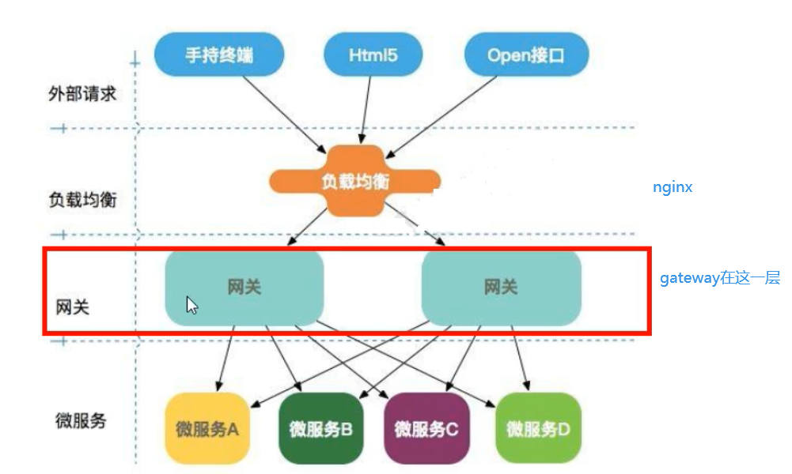
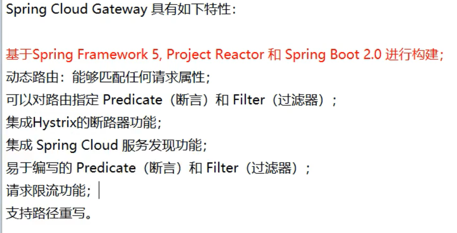
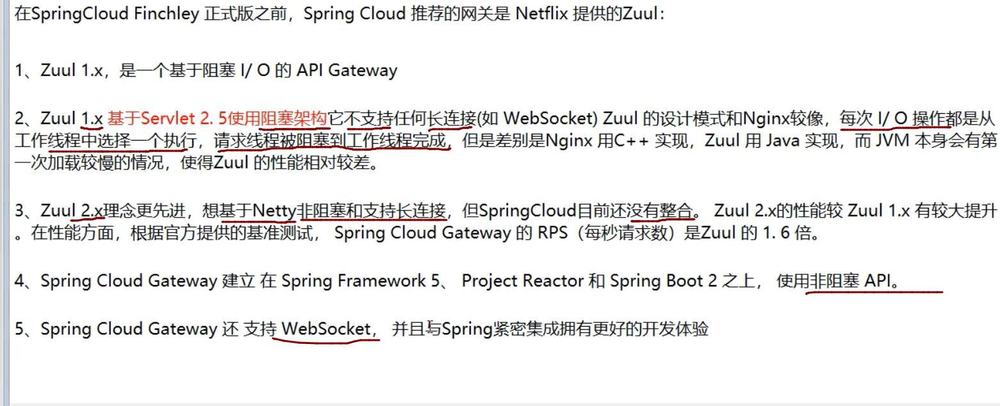
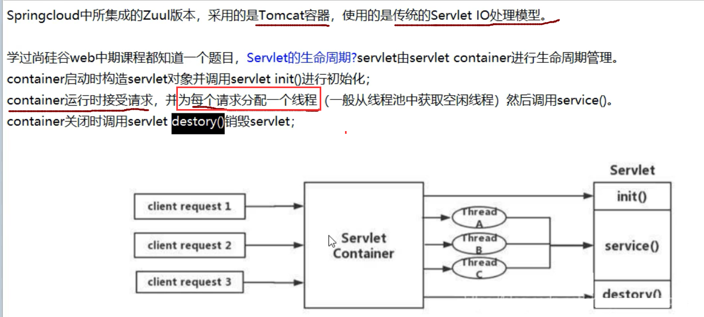

# 5,服务网关:

zuul停更了,

## 13,GateWay


**gateway之所以性能号,因为底层使用WebFlux,而webFlux底层使用netty通信(NIO)**



### GateWay的特性:



### GateWay与zuul的区别:



### zuul1.x的模型:




### 什么是webflux:

**是一个非阻塞的web框架,类似springmvc这样的**


### GateWay的一些概念:

#### 1,路由:


就是根据某些规则,将请求发送到指定服务上

#### 2,断言:


就是判断,如果符合条件就是xxxx,反之yyyy

#### 3,过滤:


​    **路由前后,过滤请求**

### GateWay的工作原理:


### 使用GateWay:

想要新建一个GateWay的项目

名字:    cloud14_gateway_9527

#### 1,pom

```java
<dependencies>
    <dependency>
        <groupId>org.springframework.cloud</groupId>
        <artifactId>spring-cloud-starter-gateway</artifactId>
    </dependency>
    <dependency>
        <groupId>org.springframework.cloud</groupId>
        <artifactId>spring-cloud-starter-netflix-eureka-client</artifactId>
    </dependency>
    <!--一般基础通用配置-->
    <dependency>
        <groupId>org.springframework.boot</groupId>
        <artifactId>spring-boot-devtools</artifactId>
        <scope>runtime</scope>
        <optional>true</optional>
    </dependency>
    <dependency>
        <groupId>org.projectlombok</groupId>
        <artifactId>lombok</artifactId>
        <optional>true</optional>
    </dependency>
    <dependency>
        <groupId>org.springframework.boot</groupId>
        <artifactId>spring-boot-starter-test</artifactId>
        <scope>test</scope>
    </dependency>
</dependencies>
```


#### 2,配置文件

```java
server:
  port: 9527

spring:
  application:
    name: cloud-gateway
eureka:
  instance:
    hostname: cloud-gateway-service
  client:
    service-url:
        register-with-eureka: true
        fetch-registry: true
        defaultZone: http://eureka7001.com:7001/eureka

```


#### 3,主启动类

```java
@SpringBootApplication
@EnableEurekaClient
public class GateWayMain9527 {
    public static void main(String[] args) {
            SpringApplication.run(GateWayMain9527.class,args );
        }
}
```


#### 4,针对pay模块,设置路由:


##### **==修改GateWay模块(9527)的配置文件==:**

```java
spring:
  application:
    name: cloud-gateway
  cloud:
    gateway:
      discovery:
        locator:
          enabled: true #开启从注册中心动态创建路由的功能，利用微服务名进行路由
      routes:
        - id: payment_routh #payment_route    #路由的ID，没有固定规则但要求唯一，建议配合服务名
          uri: http://localhost:8001          #匹配后提供服务的路由地址
          #uri: lb://cloud-payment-service #匹配后提供服务的路由地址
          predicates:
            - Path=/payment/get/**         # 断言，路径相匹配的进行路由

        - id: payment_routh2 #payment_route    #路由的ID，没有固定规则但要求唯一，建议配合服务名
          uri: http://localhost:8001          #匹配后提供服务的路由地址
          #uri: lb://cloud-payment-service #匹配后提供服务的路由地址
          predicates:
            - Path=/payment/lb/**         # 断言，路径相匹配的进行路由
            #- After=2021-09-02T08:54:56.577+08:00[Asia/Shanghai]  #可以用来做秒杀
            #- Cookie=username,Chang
            #- Header=X-Request-Id, \d+  # 请求头要有X-Request-Id属性并且值为整数的正则表达式
```


这里表示,

 当访问localhost:9527/payment/get/31时,

 路由到localhost:8001/payment/get/31

#### 5,开始测试

**启动7001,8001,9527**

```java
如果启动GateWay报错
        可能是GateWay模块引入了web和监控的starter依赖,需要移除
```

访问:

 localhost:9527/payment/get/31


#### 6,GateWay的网关配置,

​        **GateWay的网关配置,除了支持配置文件,还支持硬编码方式**

#### 7使用硬编码配置GateWay:

##### 创建配置类:

```java
@Configuration
public class GateWayConfig {
/**
 *配置了一个id为route-name的路由规则,
 *当访问地址http://localhost:9527/guoji时会自动转发到地址: http://news.baidu.com/guonei
 */
    @Bean
    public RouteLocator customRouteLocator(RouteLocatorBuilder routeLocatorBuilder) {
        RouteLocatorBuilder.Builder routes = routeLocatorBuilder.routes();
        routes.route("path_route_Chang", r -> r.path("/guoji").uri("http://news.baidu.com/guonei"))
                .build();
        return routes.build();
    }
}
```


#### 8,然后重启服务即可

### 重构:

上面的配置虽然首先了网关,但是是在配置文件中写死了要路由的地址

现在需要修改,不指定地址,而是根据微服务名字进行路由,我们可以在注册中心获取某组微服务的地址

需要:

 1个eureka,2个pay模块

#### 修改GateWay模块的配置文件:

```
将uri换成lb开头的
```


#### 然后就可以启动微服务.测试

```ABAP
7001 启动集群版的8001 8002 9527
http://localhost:9527/payment/lb 会实现负载均衡
```


### Pridicate断言:


**我们之前在配置文件中配置了断言:**

**这个断言表示,如果外部访问路径是指定路径,就路由到指定微服务上**

可以在控制台往上翻看到,这里有一个Path,这个是断言的一种,==断言的类型==:


**获取当前时区**

```
创建一个测试类
public static void main(String[] args) {
        ZonedDateTime time = ZonedDateTime.now();
        System.out.println(time);
    }
```

```java
After:
        可以指定,只有在指定时间后,才可以路由到指定微服务
            
- After=2021-09-02T08:54:56.577+08:00[Asia/Shanghai]  #可以用来做秒杀            
```

 这里表示,只有在==当前时间==之后,访问==才可以路由==

 在此之前的访问,都会报404


```java
before:
        与after类似,他说在指定时间之前的才可以访问
        between:
        需要指定两个时间,在他们之间的时间才可以访问
```


```java
cookie:
        只有包含某些指定cookie(key,value),的请求才可以路由
```


```java
   predicates:
            - Path=/payment/lb/**         # 断言，路径相匹配的进行路由
            - After=2021-09-02T08:54:56.577+08:00[Asia/Shanghai]  #可以用来做秒杀
            - Cookie=username,Chang #表示,只有cookie包含username,并且value是Chang的才可以路由
```


在cmd中curl http://localhost:9527/payment/lb --cookie "username=Chang"可以实现轮询


```java
Header:
        只有包含指定请求头的请求,才可以路由
```


测试:


```java
host:
        只有指定主机的才可以访问,
        比如我们当前的网站的域名是www.aa.com
        那么这里就可以设置,只有用户是www.aa.com的请求,才进行路由
```


可以看到,如果带了域名访问,就可以,但是直接访问ip地址.就报错了

```java
method:
        只有指定请求才可以路由,比如get请求...
```


```java
path:
        只有访问指定路径,才进行路由
        比如访问,/abc才路由
```


```java
Query:
        必须带有请求参数才可以访问
```


### Filter过滤器:


#### 生命周期:

**在请求进入路由之前,和处理请求完成,再次到达路由之前**

#### 种类:


GateWayFilter,单一的过滤器

**与断言类似,比如闲置,请求头,只有特定的请求头才放行,反之就过滤**:


GlobalFilter,全局过滤器:

#### **自定义过滤器:**

实现两个接口

```java
@Component
@Slf4j
public class MyLogGateWayFilter implements GlobalFilter, Ordered {

    @Override
    public Mono<Void> filter(ServerWebExchange exchange, GatewayFilterChain chain) {
        log.info("*****come in MyLogGateWayFilter: "+new Date());
        String uname = exchange.getRequest().getQueryParams().getFirst("uname");//获取到请求参数uname
        if (uname==null){//如果uname为空,就直接过滤掉,不走路由
            log.info("***用户名为null，非法用户，┭┮﹏┭┮");
            exchange.getResponse().setStatusCode(HttpStatus.NOT_ACCEPTABLE);
            return exchange.getResponse().setComplete();
        }
        return chain.filter(exchange);//反之,调用下一个过滤器，也就是放行
    }

    @Override
    public int getOrder() {
        return 0;
    }
}
```


​    **然后启动7001 8001 8002 9527服务即可,因为过滤器通过@Componet已经加入到容器了**

```java
http://localhost:9527/payment/lb?uname=???
http://localhost:9527/payment/lb则访问不了
```


