# 6,服务配置:

## Spring Config分布式配置中心:

==微服务面临的问题==

```java
可以看到,每个微服务都需要一个配置文件,并且,如果有几个微服务都需要连接数据库
        那么就需要配4次数据库相关配置,并且当数据库发生改动,那么需要同时修改4个微服务的配置文件才可以
```

所以有了springconfig配置中心

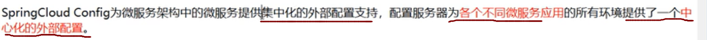

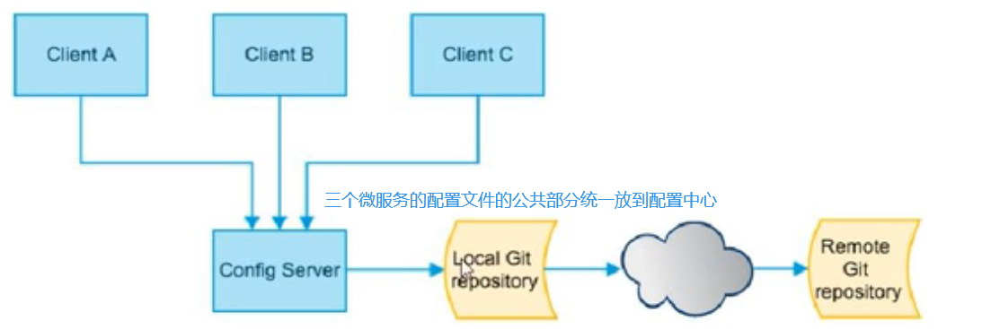

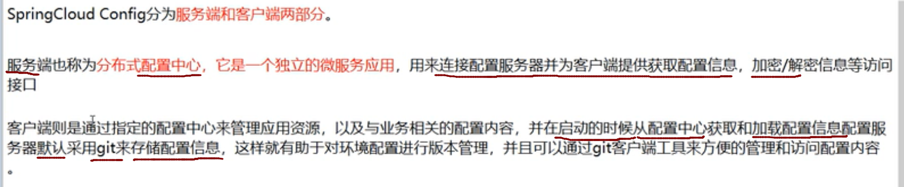

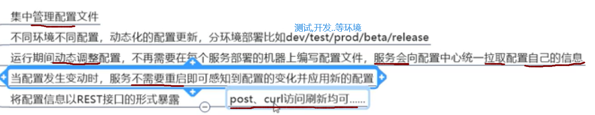

### 使用配置中心:

#### 0,使用github作为配置中心的仓库:

**初始化git环境:**

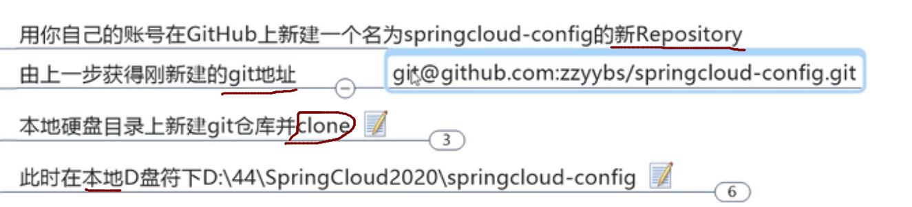

#### 1,新建config模块:

名字:   cloud-config-3344

#### 2,pom

```java
<dependencies>
    <dependency>
        <groupId>org.springframework.cloud</groupId>
        <artifactId>spring-cloud-config-server</artifactId>
    </dependency>
    <dependency>
        <groupId>org.springframework.boot</groupId>
        <artifactId>spring-boot-starter-actuator</artifactId>
    </dependency>
    <dependency>
        <groupId>org.springframework.boot</groupId>
        <artifactId>spring-boot-starter-web</artifactId>
    </dependency>
    <dependency>
        <groupId>org.springframework.cloud</groupId>
        <artifactId>spring-cloud-starter-netflix-eureka-client</artifactId>
    </dependency>

    <!--一般基础通用配置-->
    <dependency>
        <groupId>org.springframework.boot</groupId>
        <artifactId>spring-boot-devtools</artifactId>
        <scope>runtime</scope>
        <optional>true</optional>
    </dependency>
    <dependency>
        <groupId>org.projectlombok</groupId>
        <artifactId>lombok</artifactId>
        <optional>true</optional>
    </dependency>
    <dependency>
        <groupId>org.springframework.boot</groupId>
        <artifactId>spring-boot-starter-test</artifactId>
        <scope>test</scope>
    </dependency>
</dependencies>

```


#### 3,配置文件

```java
server:
  port: 3344

spring:
  application:
    name: cloud-config-center #注册eureka服务的微服务
  cloud:
    config:
      server:
        git:
          uri: https://github.com/Chang1047/springcloud-config.git  #Github上仓库的名字
          search-paths:  ###搜素目录
            - springcloud-config

      label: master     #读取分支


#服务注册到eureka地址
eureka:
  client:
    service-url:
      defaultZone: http://localhost:7001/eureka
```


#### 4,主启动类

```java
@SpringBootApplication
@EnableConfigServer//启动配置中心的服务端
@EnableEurekaClient
public class ConfigCenterMain3344 {
    public static void main(String[] args) {
            SpringApplication.run(ConfigCenterMain3344.class,args);
        }
}
```


#### 5,修改hosts:

==windows下修改hosts文件，增加映射==

==127.0.0.1 config-3344.com==


#### 6,配置完成

测试,3344是否可以从github上获取配置

启动3344    (要先启动eureka)

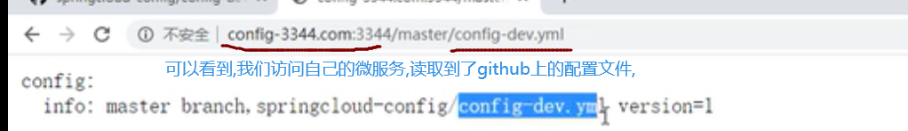

它实际上就是,读取到配置文件中的GitHub的地址,然后拼接上/master/config-dev.yml

#### 7,读取配置文件的规则:

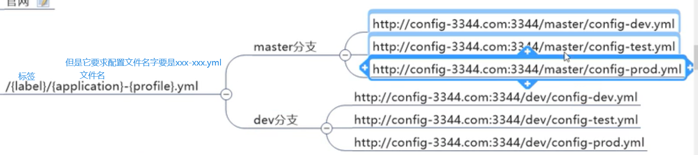

==2,==


**这里默认会读取master分支,因为我们配置文件中配置了**

label:master


==3==

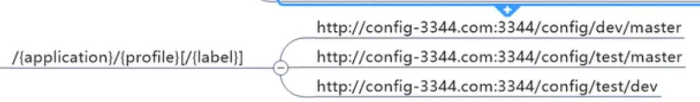

注意,这个方式读取到的配置是==json格式==的

**所有规则:**

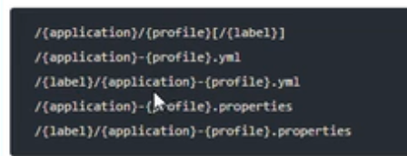

### 2,创建配置中心客户端:

#### 1,创建config客户端项目

名字:    cloud16-config-client-3355

#### 2,pom

```java
<dependencies>
    <dependency>
            <groupId>org.springframework.cloud</groupId>
            <artifactId>spring-cloud-starter-bootstrap</artifactId>
            <version>3.0.3</version>
        </dependency>
        <dependency>
            <groupId>org.springframework.cloud</groupId>
            <artifactId>spring-cloud-starter-config</artifactId>
        </dependency>
        <dependency>
            <groupId>org.springframework.cloud</groupId>
            <artifactId>spring-cloud-starter-netflix-eureka-client</artifactId>
        </dependency>
        <dependency>
            <groupId>org.springframework.boot</groupId>
            <artifactId>spring-boot-starter-web</artifactId>
        </dependency>
        <dependency>
            <groupId>org.springframework.boot</groupId>
            <artifactId>spring-boot-starter-actuator</artifactId>
        </dependency>
        
        <!--一般基础通用配置-->
        <dependency>
            <groupId>org.springframework.boot</groupId>
            <artifactId>spring-boot-devtools</artifactId>
            <scope>runtime</scope>
            <optional>true</optional>
        </dependency>
        <dependency>
            <groupId>org.projectlombok</groupId>
            <artifactId>lombok</artifactId>
            <optional>true</optional>
        </dependency>
        <dependency>
            <groupId>org.springframework.boot</groupId>
            <artifactId>spring-boot-starter-test</artifactId>
            <scope>test</scope>
        </dependency>
    </dependencies>
```


#### 3,配置文件

注意这个配置文件就不是application.yml

 而是bootstrap.yml

这个配置文件的作用是,先到配置中心加载配置,然后加载到application.yml中

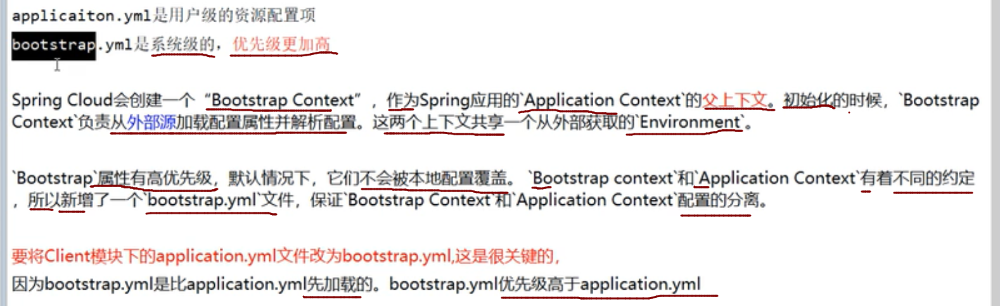

```java
server:
  port: 3355


spring:
  application:
    name: config-client
  cloud:
    #config客户端配置
    config:
      label: master  #分支名称
      name: config   #配置文件名称
      profile: dev   #读取后缀名称
      #这四个整合在一起的意思是:客户端会读取http://localhost3344/master/config-dev.yml上面的配置文件
      
      uri: http://localhost:3344

#服务注册到eureka地址
eureka:
  client:
    service-url:
      defaultZone: http://localhost:7001/eureka

```


#### 4,主启动类:

```java
@SpringBootApplication
@EnableEurekaClient
public class ConfigClientMain3355 {
    public static void main(String[] args) {
            SpringApplication.run(ConfigClientMain3355.class,args );
        }
}

```


#### 5,controller类

就是上面提到的,以rest风格将配置对外暴露

```java
@RestController
public class ConfigClientController {
    @Value("${config.info}")
    private String configInfo;

    @GetMapping("/configInfo")
    public String getConfigInfo(){
        return configInfo;
    }
}
```


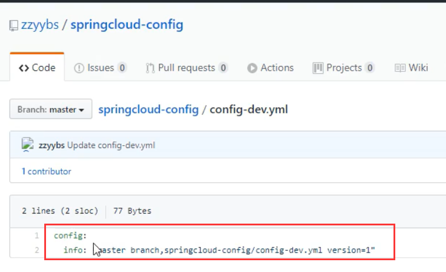

**如果客户端运行正常,就会读取到github上配置文件的,config.info下的配置**

#### 6,测试:

启动7001 ,3344,3355

 访问3355的 /configInfo


#### 7,问题::

```java
上面3355确实获取到了配置文件,但是如果此时配置文件修改了,3355是获取不到的
        3344可以实时获取到最新配置文件,但是3355却获取不到
        除非重启服务
```

#### **8,实现动态刷新:**

##### 1,3355修改配置文件,添加一个配置:

```java
#暴露监控端点
management:
  endpoints:
    web:
      exposure:
        include: "*"
```

##### 2,修改controller,添加注解:

```java
@RestController
@RefreshScope
public class ConfigClientController {
    @Value("${config.info}")
    private String configInfo;

    @GetMapping("/configInfo")
    public String getConfigInfo(){
        return configInfo;
    }
}

```

##### 3.测试服务

[config-3344.com:3344/master/config-dev.yml](http://config-3344.com:3344/master/config-dev.yml)

[localhost:3355/configInfo](http://localhost:3355/configInfo)

==每当Github中修改，3344刷新后能获取新值，而3355只能重启之后获取==

##### 4,此时重启服务

**此时3355还不可以动态获取**

因为此时,还需要==外部==发送post请求通知3355

```
            win+r 进入cmd中输入如下：
curl -X POST "http://localhost:3355/actuator/refresh"   
```

**此时在刷新3355,发现可以获取到最新的配置文件了,这就实现了动态获取配置文件,因为3355并没有重启**

具体流程就是:

 我们启动好服务后

 运维人员,修改了配置文件,然后发送一个post请求通知3355

 3355就可以获取最新配置文件

**问题:**

 如果有多个客户端怎么办(3355,3356,3357.....)

 虽然可以使用shell脚本,循环刷新

 但是,可不可以使用广播,一次通知??

 这些springconfig做不到,需要使用springcloud Bus消息总线

