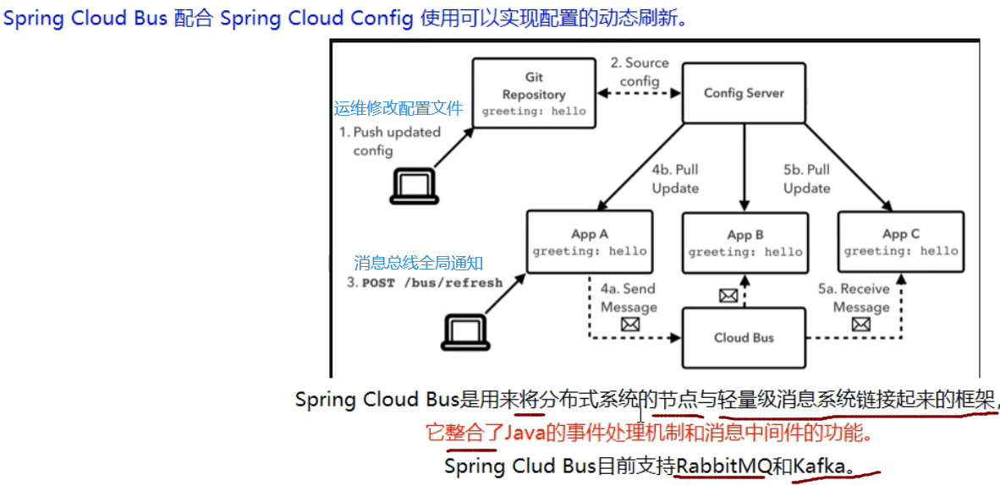
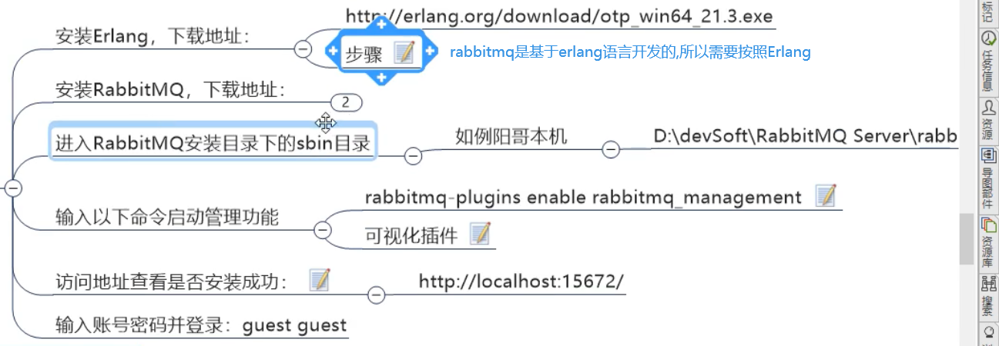
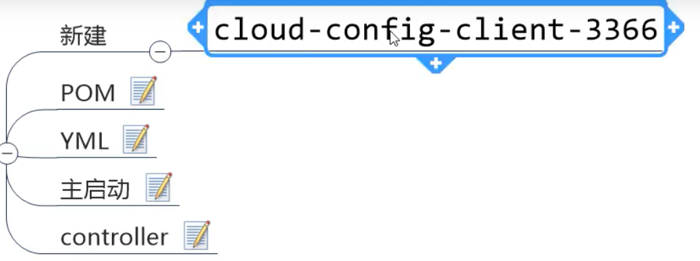
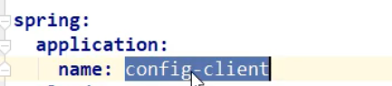

# 消息总线:

## SpringCloud Bus:




注意,这里年张图片,就代表两种广播方式

 图1:        **它是Bus直接通知给其中一个客户端,由这个客户端开始蔓延,传播给其他所有客户端**

 图2:        它**是通知给配置中心的服务端,有服务端广播给所有客户端**

**为什么被称为总线?**


```java
就是通过消息队列达到广播的效果
        我们要广播每个消息时,主要放到某个topic中,所有监听的节点都可以获取到
```

### 使用Bus:

#### 1,配置rabbitmq环境:

```
https://www.erlang.org/downloads/24.0
https://www.rabbitmq.com/install-windows.html

rabbitmq-plugins enable rabbitmq_management

解决用户名为中文的方法
https://github.com/Chang1047/RabbitMQ/tree/master
```



#### **2,之前只有一个配置中心客户端,这里在创建一个**

 ==**复制3355即可,创建为3366**==



全部复制3355，改下端口号

```java
@RestController
@RefreshScope
public class ConfigClientController {
    @Value("${server.port}")
    private String serverPort;

    @Value("${config.info}")
    private String configInfo;

    @GetMapping("/configInfo")
    public String getConfigInfo(){
        return "serverPort:"+serverPort+"\t\n\n configInfo:"+configInfo;
    }
}
```


#### 2,使用Bus实现全局广播

**Bus广播有两种方式:**

 ==就是上面两个图片的两种方式==


**这两种方式,第二种跟合适,因为:**

 ==第一种的缺点:==


#### **配置第二种方式:**

##### **1,配置3344(配置中心服务端):**

###### 1,添加配置:

```
  #rabbitmq相关配置，15672是web管理界面的端口; 5672是MQ访问的端口
  rabbitmq:
     host: localhost
     port: 5672
     username: guest
     password: guest
```

```
##rabbitmq相关配置,暴露bus刷新配置的端点
management:
  endpoints: #暴露bus刷新配置的端点
    web:
      exposure:
        include: 'bus-fresh'
```


###### 2,3344添加pom

```java
<!--添加消息总线RabbitMQ支持-->
<dependency>
        <groupId>org.springframework.cloud</groupId>
        <artifactId>spring-cloud-starter-bus-amqp</artifactId>
    </dependency>
```


##### 2,修改3355(配置中心的客户端)

###### 1,pom:

```java
<!--添加消息总线RabbitMQ支持-->
<dependency>
        <groupId>org.springframework.cloud</groupId>
        <artifactId>spring-cloud-starter-bus-amqp</artifactId>
    </dependency>
```

###### 2,配置文件:

==注意配置文件的名字,为bootstrap.yml==

```java
  #rabbitmq相关配置，15672是web管理界面的端口; 5672是MQ访问的端口
  rabbitmq:
     host: localhost
     port: 5672
     username: guest
     password: guest
```


##### 3,修改3366(也是配置中心的客户端)

 修改与3355是一模一样的

##### 4,测试

启动7001,3344,3355,3366

此时修改GitHub上的配置文件

==此时只需要刷新3344,即可让3355,3366动态获取最新的配置文件==

```
curl -X POST "http://localhost:3344/actuator/busrefresh"
```

其原理就是:


**所有客户端都监听了一个rabbitMq的topic,我们将信息放入这个topic,所有客户端都可以送到,从而实时更新**

#### 配置定点通知

 就是只通知部分服务,比如只通知3355,不通知3366


**只通知3355**

```java
curl -X POST "http://localhost:3344/actuator/busrefresh/config-client:3355"
```


​    

**可以看到,实际上就是通过==微服务的名称+端口号==进行指定**

# 