# 消息驱动:

## Spring Cloud Stream:

```java
现在一个很项目可能分为三部分:
        前端--->后端---->大数据
        而后端开发使用消息中间件,可能会使用RabbitMq
        而大数据开发,一般都是使用Kafka,
        那么一个项目中有多个消息中间件,对于程序员,因为人员都不友好
```

而Spring Cloud Stream就类似jpa,屏蔽底层消息中间件的差异,程序员主要操作Spring Cloud Stream即可

 不需要管底层是kafka还是rabbitMq


### ==什么是Spring Cloud Stream==

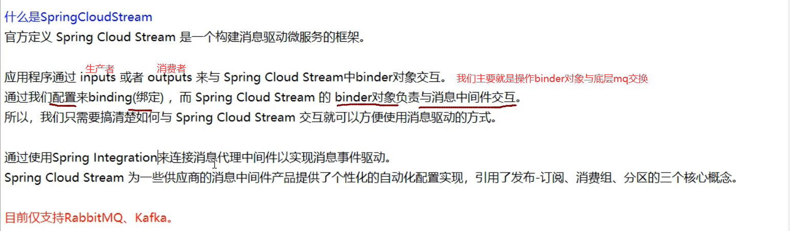

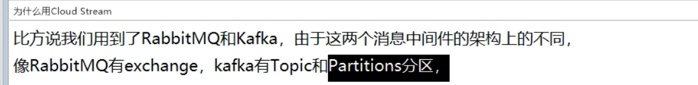

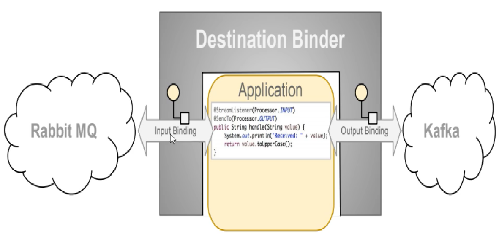

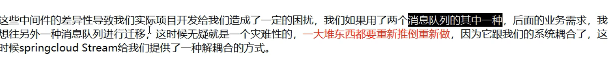

### ==**Spring Cloud Stream是怎么屏蔽底层差异的?**==

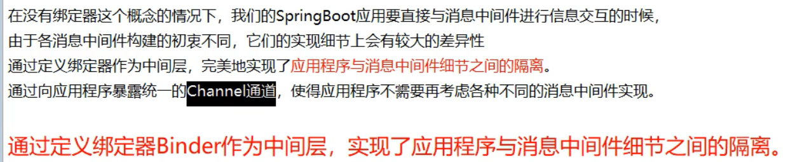

**绑定器:**

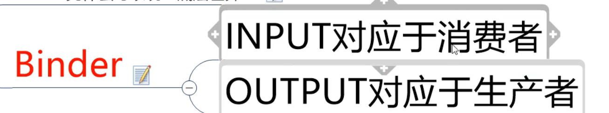

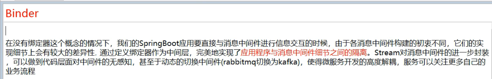

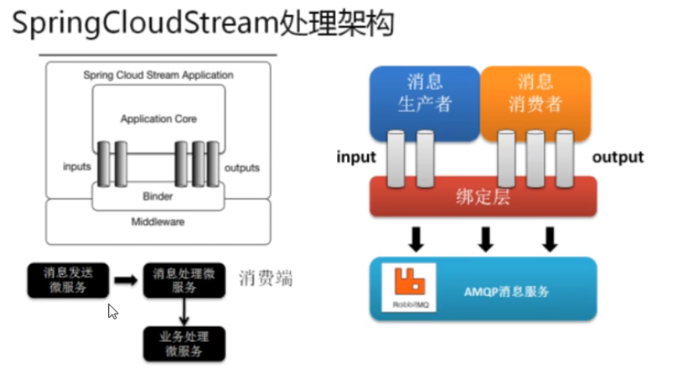

### **Spring Cloud Streamd 通信模式:**

/图片/SpringCloudStream的11.png)

### Spring Cloud Stream的业务流程:

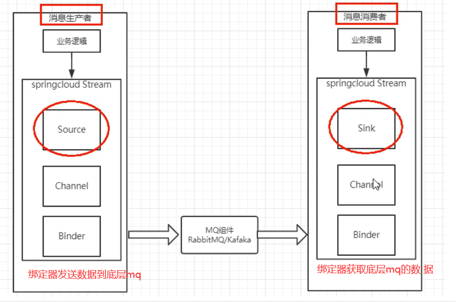


```java
类似flume中的channel,source,sink 估计是借鉴(抄袭)的
        source用于获取数据(要发送到mq的数据)
        channel类似SpringCloudStream中的中间件,用于存放source接收到的数据,或者是存放binder拉取的数据    
```

### 常用注解和api:

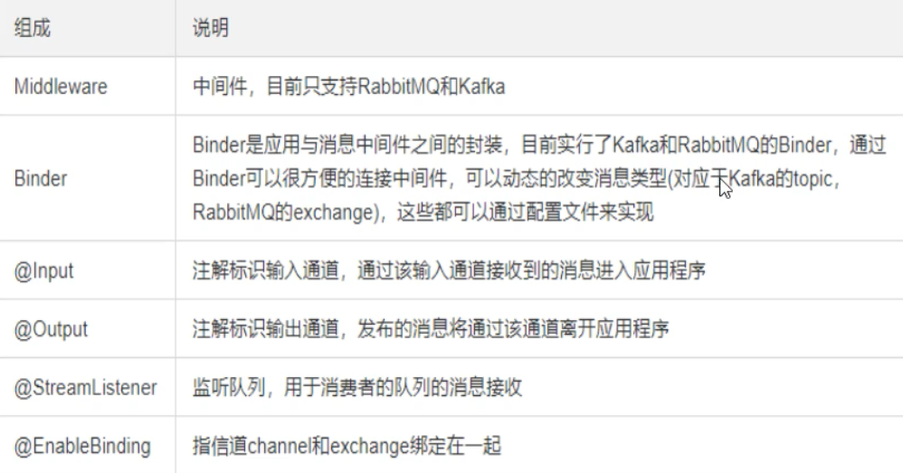

### 使用SpringCloudStream:

需要创建三个项目,一个生产者,两个消费者

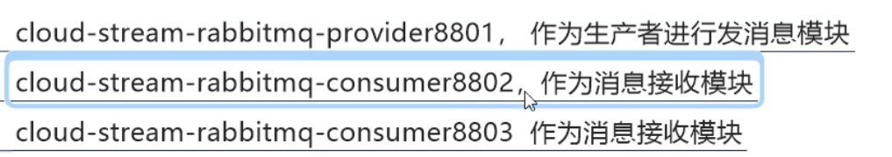

### 1,创建生产者

cloud18-stream-rabbitmq-provider8801

#### 1,pom

```java
<dependencies>
    <dependency>
        <groupId>org.springframework.boot</groupId>
        <artifactId>spring-boot-starter-web</artifactId>
    </dependency>
    <dependency>
        <groupId>org.springframework.boot</groupId>
        <artifactId>spring-boot-starter-actuator</artifactId>
    </dependency>
    <dependency>
        <groupId>org.springframework.cloud</groupId>
        <artifactId>spring-cloud-starter-netflix-eureka-client</artifactId>
    </dependency>
    <dependency>
        <groupId>org.springframework.cloud</groupId>
        <artifactId>spring-cloud-starter-stream-rabbit</artifactId>
    </dependency>
    <!--一般基础通用配置-->
    <dependency>
        <groupId>org.springframework.boot</groupId>
        <artifactId>spring-boot-devtools</artifactId>
        <scope>runtime</scope>
        <optional>true</optional>
    </dependency>
    <dependency>
        <groupId>org.projectlombok</groupId>
        <artifactId>lombok</artifactId>
        <optional>true</optional>
    </dependency>
    <dependency>
        <groupId>org.springframework.boot</groupId>
        <artifactId>spring-boot-starter-test</artifactId>
        <scope>test</scope>
    </dependency>
</dependencies>
```


#### 2,配置文件

```java
server:
  port: 8801

spring:
  application:
    name: cloud-stream-provider
  cloud:
    stream:
      binders: # 在此处配置要绑定的rabbitmq的服务信息；
        defaultRabbit: # 表示定义的名称，用于于binding整合
          type: rabbit # 消息组件类型
          environment: # 设置rabbitmq的相关的环境配置
            spring:
              rabbitmq:
                host: localhost
                port: 5672
                username: guest
                password: guest
      bindings: # 服务的整合处理
        output: # 这个名字是一个通道的名称
          destination: studyExchange # 表示要使用的Exchange名称定义
          content-type: application/json # 设置消息类型，本次为json，文本则设置“text/plain”
          binder: defaultRabbit # 设置要绑定的消息服务的具体设置

eureka:
  client: # 客户端进行Eureka注册的配置
    service-url:
      defaultZone: http://localhost:7001/eureka
  instance:
    lease-renewal-interval-in-seconds: 2 # 设置心跳的时间间隔（默认是30秒）
    lease-expiration-duration-in-seconds: 5 # 如果现在超过了5秒的间隔（默认是90秒）
    instance-id: send-8801.com  # 在信息列表时显示主机名称
    prefer-ip-address: true     # 访问的路径变为IP地址

```


#### 3,主启动类

```java
@SpringBootApplication
public class StreamMQMain8801 {
    public static void main(String[] args) {
            SpringApplication.run(StreamMQMain8801.class,args );
        }
}
```


#### 4,service和实现类

service定义发送消息

```java
public interface IMessageProvider {
    public  String send();
}

```

```java
@EnableBinding(Source.class) //定义消息推送的管道，表示当前这个类是source,负责生产消息,并且发送给channel
@Slf4j
public class IMessageProviderImpl implements IMessageProvider {
    @Resource //channel,我们将消息发送个channel
    private MessageChannel output;  //消息发送管道

    @Override
    public String send() {
        String serial= UUID.randomUUID().toString();
        output.send(MessageBuilder.withPayload(serial).build());//build方法会构建一个Message类
        log.info("****serial:"+serial);
        return null;
    }
}
```

**这里,就会调用send方法,将消息发送给channel,**

​                **然后channel将消费发送给binder,然后发送到rabbitmq中**

#### 5,controller

```java
@RestController
public class SendMessageController {
    @Resource
    private IMessageProvider messageProvider;


    @GetMapping(value = "/sendMessage")
    public String sendMessage(){
        return  messageProvider.send();

    }
}

```


#### 6,可以测试

**启动rabbitmq**

**启动7001,8801**

 确定8801后,会在rabbitmq中创建一个Exchange,就是我们配置文件中配置的exchange

**访问8801的/sendMessage**

### 创建消费者:

#### 1,pom文件

和8801一样

#### 2,配置文件

==**这里排版一点问题**==

**==input==就表示,当前服务是一个消费者,需要消费消息,下面就是指定消费哪个Exchange中的消息**

```java
server:
  port: 8802

spring:
  application:
    name: cloud-stream-consumer
  cloud:
      stream:
        binders: # 在此处配置要绑定的rabbitmq的服务信息；
          defaultRabbit: # 表示定义的名称，用于于binding整合
            type: rabbit # 消息组件类型
            environment: # 设置rabbitmq的相关的环境配置
              spring:
                rabbitmq:
                  host: localhost
                  port: 5672
                  username: guest
                  password: guest
        bindings: # 服务的整合处理
          input: # 这个名字是一个通道的名称
            destination: studyExchange # 表示要使用的Exchange名称定义
            content-type: application/json # 设置消息类型，本次为对象json，如果是文本则设置“text/plain”
            binder: defaultRabbit # 设置要绑定的消息服务的具体设置


eureka:
  client: # 客户端进行Eureka注册的配置
    service-url:
      defaultZone: http://localhost:7001/eureka
  instance:
    lease-renewal-interval-in-seconds: 2 # 设置心跳的时间间隔（默认是30秒）
    lease-expiration-duration-in-seconds: 5 # 如果现在超过了5秒的间隔（默认是90秒）
    instance-id: receive-8802.com  # 在信息列表时显示主机名称
    prefer-ip-address: true     # 访问的路径变为IP地址
```


#### 3,主启动类

```java
@SpringBootApplication
public class StreamMQMain8802 {    
    public static void main(String[] args) {            SpringApplication.run(StreamMQMain8802.class,args);        }
}
```

#### 4,业务类(消费数据)

```java
@Component@EnableBinding(Sink.class)//启用绑定,就是表示当前类是sink,负责介绍channel发送过来的数据进行消费
public class ReceiveMessageListenerController {    
    @Value("${server.port}")    
    private  String serverPort;    
    @StreamListener(Sink.INPUT)//这里表示监听sink的input,而input我们在配置文件中配置了,绑定在一个指定Exchange上获取数据    
    public void input(Message<String> message){        
        System.out.println("消费者1号，---接收到信息："+message.getPayload()+"\t port:"+serverPort);   
    }
}
```


**生产者发送消息时,使用send方法发送,send方法发送的是一个个Message,里面封装了数据**

#### 5,测试:

启动7001.8801.8802

**此时使用生产者生产消息**

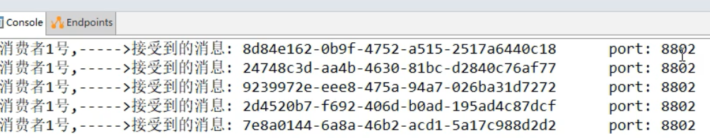

==可以看到,消费者已经接收到消息了==

### 创建消费者2

创建8803,直接复制8802，并修改相应的端口号

#### ==若module没有蓝色框框==

```ABAP
点击右上角maven的+号，把对应的pom.xml加入其中，就OK了
```

### ==重复消费问题:==

此时启动7001.8801.8802.8803

此时生产者生产一条消息

但是此时查询消费者,发现8802,8803==都消费到了同一条数据==

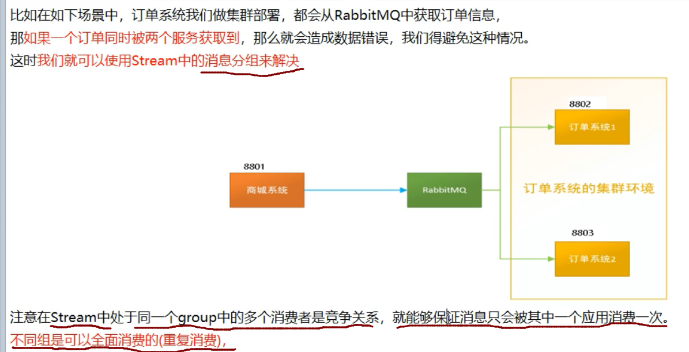


#### 1,自定义分组

**修改8802,8803的配置文件**

在biner：defaultRabbit正下方分别输入：

group: 名字1

group: 名字2

```
当两个消费者在不同组时，生产者发送信息，不同的消费者都能收到信息
```

**现在将8802,8803都分到了名字1组**

然后去重启8802,8803，刷新2次[localhost:8801/sendMessage](http://localhost:8801/sendMessage)

**然后此时生产者生产两条消息**

两个消费者各收到了一个信息，实现了轮询，没有重复消费


### 持久化问题:

就是当服务挂了,怎么消费没有消费的数据??

这里,先将8802移除A组,

 然后将02,03服务关闭

此时生产者开启,发送3条消息

 此时重启02,03

 可以看到,当02退出A组后,它就获取不到在它宕机的时间段内的数据

 但是03重启后,直接获取到了宕机期间它没有消费的数据,并且消费了

总结:
也就是,当我们没有配置分组时,会出现消息漏消费的问题

 而配置分组后,我们可以自动获取未消费的数据