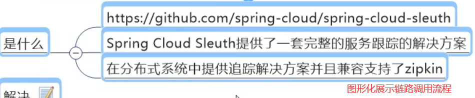
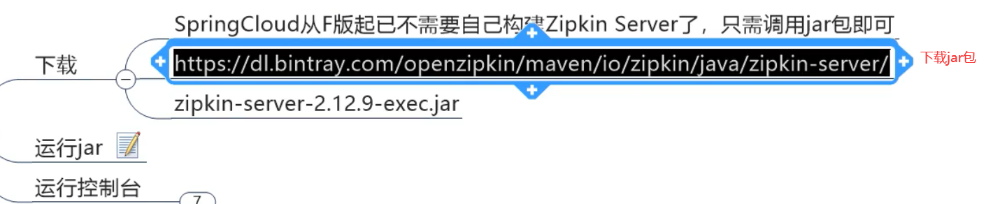
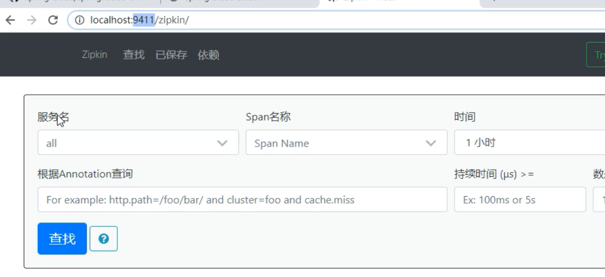
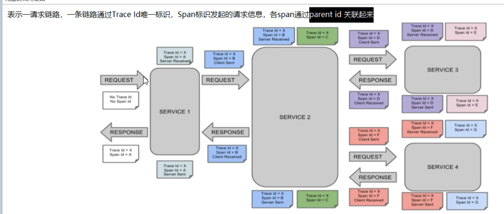
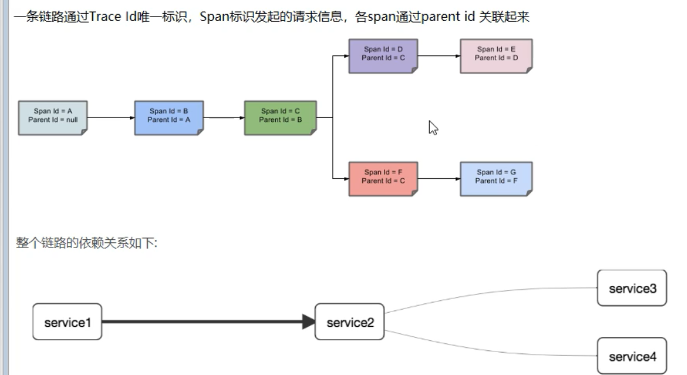
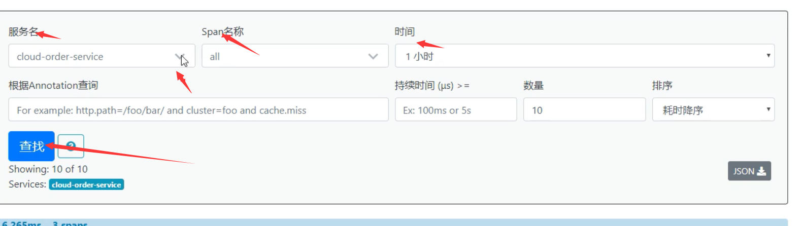

# 链路追踪:

## Spring Cloud Sleuth

**sleuth要解决的问题:**


**而来sleuth就是用于追踪每个请求的整体链路**



### 使用sleuth:

#### 1,安装zipkin:



**运行jar包**，在文件的位置使用cmd并使用如下

```
java -jar zipkin-server-2.12.9-exec.jar
```

如出现一个箭头则说明成功！

**然后就可以访问web界面, 默认zipkin监听的端口是9411**

 localhost:9411/zipkin/



**一条链路完整图片:**



**精简版:**



**可以看到,类似链表的形式**

#### 2,使用sleuth:

不需要额外创建项目,使用之前的8001和order的80即可

##### 1,修改8001

**引入pom:**

```java
<!--包含了sleuth+zipkin-->
		<dependency>
            <groupId>org.springframework.cloud</groupId>
            <artifactId>spring-cloud-starter-zipkin</artifactId>
            <version>2.2.8.RELEASE</version>
        </dependency>
```

这个包虽然叫zipkin但是,里面包含了zpikin与sleuth

**添加配置文件:**

```java
spring:
  application:
    name: cloud-payment-service
  zipkin:
    base-url: http://localhost:9411
  sleuth:
    sampler:
      probability:  1 #采样值介于0-1之间，1则表示全部采集  
```


cotroller中添加如下

```java
 @GetMapping("/payment/zipkin")
    public String paymentZipkin(){
        return "hi ,I'm paymentZipkin server fall back, welcome to xxx, o(n_n)o哈哈~";
    }
```


##### 2,修改80

**添加pom**

与上面是一样的

**添加配置文件**:

与上面也是一样的

**controller中添加**

```java
   //zipkin+sleuth
    @GetMapping("/consumer/payment/zipkin")
    public String paymentZipkin(){
    String result = restTemplate.getForObject("http://localhost:8001"+"/payment/zipkin/", String.class);
    return result;
    }
```


##### 3,测试:

启动7001.8001,80,9411



